# Galeria de logos

> Arquivo gerado automaticamente pelo pipeline (`npm run pipeline`) — não editar à mão.

**473** instituições com logo · **640** sem logo nas fontes oficiais.

| Logo | COMPE | ISPB | Instituição | Fonte do logo |
|---|---|---|---|---|
|  | 0001 | 00000000 | BCO DO BRASIL S.A. | Open Finance — BANCO DO BRASIL S.A. |
|  | 0003 | 04902979 | BCO DA AMAZONIA S.A. | Open Finance — BCO DA AMAZONIA S.A. |
|  | 0004 | 07237373 | BCO DO NORDESTE DO BRASIL S.A. | Open Finance — BCO DO NORDESTE DO BRASIL S.A. |
|  | 0011 | 61809182 | UBS (BRASIL) CORRETORA DE VALORES S.A. | URL direta (revisada) |
|  | 0014 | 09274232 | STATE STREET BR S.A. BCO COMERCIAL | URL direta (revisada) |
|  | 0015 | 02819125 | UBS BB CCTVM S.A. | URL direta (revisada) |
|  | 0016 | 04715685 | CCM DESP TRÂNS SC E RS | Open Finance — Confederacao Nacional das Cooperativas do Sicoob |
| 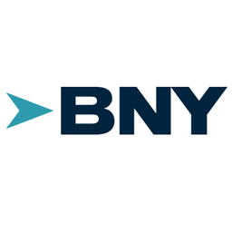 | 0017 | 42272526 | BNY MELLON BCO S.A. | URL direta (revisada) |
| 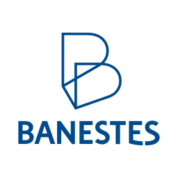 | 0021 | 28127603 | BCO BANESTES S.A. | Open Finance — BCO BANESTES S.A. |
|  | 0033 | 90400888 | BCO SANTANDER (BRASIL) S.A. | Open Finance — BCO SANTANDER (BRASIL) S.A. |
|  | 0036 | 06271464 | BCO BBI S.A. | Open Finance — BANCO BRADESCO SA |
|  | 0037 | 04913711 | BCO DO EST. DO PA S.A. | Open Finance — BCO DO EST. DO PA S.A. |
| 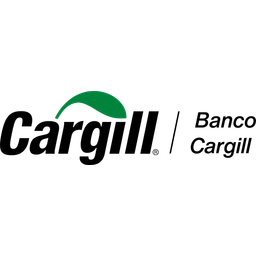 | 0040 | 03609817 | BCO CARGILL S.A. | URL direta (revisada) |
|  | 0041 | 92702067 | BCO DO ESTADO DO RS S.A. | Open Finance — BCO DO ESTADO DO RS S.A. |
| 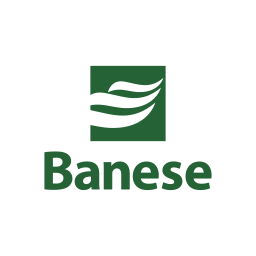 | 0047 | 13009717 | BCO DO EST. DE SE S.A. | Open Finance — BCO DO EST. DE SE S.A. |
|  | 0063 | 04184779 | BANCO BRADESCARD | Open Finance — BANCO BRADESCARD |
|  | 0064 | 04332281 | GOLDMAN SACHS DO BRASIL BM S.A | URL direta (revisada) |
|  | 0066 | 02801938 | BCO MORGAN STANLEY S.A. | URL direta (revisada) |
| 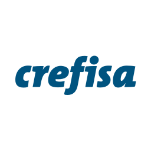 | 0069 | 61033106 | BCO CREFISA S.A. | Open Finance — BCO CREFISA S.A. |
|  | 0070 | 00000208 | BRB - BCO DE BRASILIA S.A. | Open Finance — BRB - BCO DE BRASILIA S.A. |
|  | 0074 | 03017677 | BCO. J.SAFRA S.A. | Open Finance — BCO SAFRA S.A. |
|  | 0077 | 00416968 | BANCO INTER | Open Finance — BANCO INTER |
|  | 0079 | 09516419 | PICPAY BANK - BANCO MÚLTIPLO S.A | Open Finance — PICPAY |
| 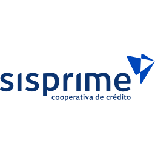 | 0084 | 02398976 | SISPRIME DO BRASIL - COOP | Open Finance — SISPRIME DO BRASIL - COOPERATIVA DE CREDITO |
| 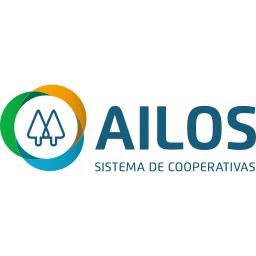 | 0085 | 05463212 | COOPCENTRAL AILOS | Open Finance — CENTRAL AILOS |
|  | 0100 | 00806535 | PLANNER CV S.A. | URL direta (revisada) |
|  | 0101 | 62287735 | WARREN RENA DTVM | URL direta (revisada) |
|  | 0102 | 02332886 | XP INVESTIMENTOS CCTVM S/A | Open Finance — BANCO XP S.A. |
|  | 0104 | 00360305 | CAIXA ECONOMICA FEDERAL | Open Finance — CAIXA ECONOMICA FEDERAL |
| 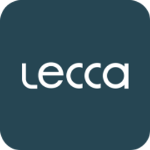 | 0105 | 07652226 | LECCA CFI S.A. | URL direta (revisada) |
|  | 0111 | 36113876 | OLIVEIRA TRUST DTVM S.A. | URL direta (revisada) |
|  | 0113 | 61723847 | NEON CTVM S.A. | Open Finance — Neon Pagamentos |
|  | 0120 | 33603457 | BCO RODOBENS S.A. | URL direta (revisada) |
| 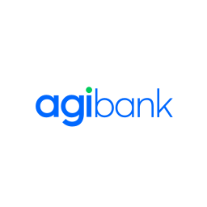 | 0121 | 10664513 | BCO AGIBANK S.A. | Open Finance — BCO AGIBANK S.A. |
|  | 0122 | 33147315 | BCO BRADESCO BERJ S.A. | Open Finance — BANCO BRADESCO SA |
|  | 0125 | 45246410 | BANCO GENIAL | Open Finance — BANCO GENIAL S.A. |
|  | 0129 | 18520834 | UBS BB BI S.A. | URL direta (revisada) |
|  | 0133 | 10398952 | CRESOL CONFEDERAÇÃO | Open Finance — CRESOL CONFEDERAÇÃO |
|  | 0136 | 00315557 | UNICRED DO BRASIL | Open Finance — COOPERATIVA CENTRAL DE CREDITO UNICRED DO BRASIL - UNICRED DO BRASIL |
|  | 0140 | 62169875 | NU INVESTIMENTOS S.A. - CTVM | Open Finance — NU PAGAMENTOS S.A. - INSTITUICAO DE PAGAMENTO |
|  | 0143 | 02992317 | INTEX BANK BCO DE CÂMBIO S.A. | URL direta (revisada) |
|  | 0174 | 43180355 | PEFISA S.A. - C.F.I. | Open Finance — PEFISA S.A. - CFI |
|  | 0197 | 16501555 | STONE IP S.A. | Open Finance — STONE PAGAMENTOS S.A. |
|  | 0208 | 30306294 | BANCO BTG PACTUAL S.A. | Open Finance — BANCO BTG PACTUAL S.A. |
| 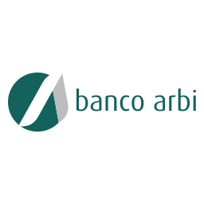 | 0213 | 54403563 | BCO ARBI S.A. | Open Finance — BCO ARBI S.A. |
| 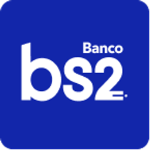 | 0218 | 71027866 | BCO BS2 S.A. | URL direta (revisada) |
|  | 0224 | 58616418 | BCO FIBRA S.A. | URL direta (revisada) |
|  | 0233 | 62421979 | BANCO BMG SOLUÇÕES FINANCEIRAS S.A. | Open Finance — BCO BMG S.A. |
|  | 0237 | 60746948 | BCO BRADESCO S.A. | Open Finance — BANCO BRADESCO SA |
| 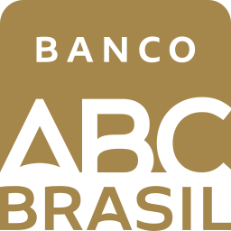 | 0246 | 28195667 | BCO ABC BRASIL S.A. | URL direta (revisada) |
|  | 0250 | 50585090 | BANCO BMG CONSIGNADO S.A. | Open Finance — BCO BMG S.A. |
|  | 0254 | 14388334 | PARANA BCO S.A. | URL direta (revisada) |
|  | 0260 | 18236120 | NU PAGAMENTOS - IP | Open Finance — NU PAGAMENTOS S.A. - INSTITUICAO DE PAGAMENTO |
|  | 0265 | 33644196 | BCO FATOR S.A. | URL direta (revisada) |
|  | 0268 | 14511781 | BARI CIA HIPOTECÁRIA | URL direta (revisada) |
|  | 0274 | 11581339 | BMP SCMEPP LTDA | Open Finance — MONEY PLUS SCMEPP LTDA |
|  | 0278 | 27652684 | GENIAL INVESTIMENTOS CVM S.A. | Open Finance — BANCO GENIAL S.A. |
|  | 0290 | 08561701 | PAGSEGURO INTERNET IP S.A. | Open Finance — PAGSEGURO |
|  | 0292 | 28650236 | GALAPAGOS DTVM S.A. | URL direta (revisada) |
| 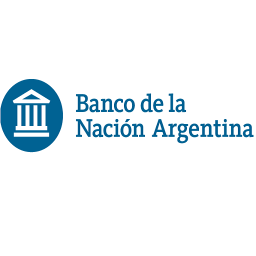 | 0300 | 33042151 | BCO LA NACION ARGENTINA | Open Finance — BCO LA NACION ARGENTINA |
|  | 0301 | 13370835 | DOCK IP S.A. | Open Finance — DOCK INSTITUICAO DE PAGAMENTO S.A. |
|  | 0310 | 22610500 | VORTX DTVM LTDA. | URL direta (revisada) |
|  | 0318 | 61186680 | BCO BMG S.A. | Open Finance — BCO BMG S.A. |
|  | 0323 | 10573521 | MERCADO PAGO IP LTDA. | Open Finance — MERCADO PAGO INSTITUICAO DE PAGAMENTO LTDA |
|  | 0326 | 03311443 | PARATI - CFI S.A. | Open Finance — PARATI - CFI S.A. |
|  | 0329 | 32402502 | QI SCD S.A. | Open Finance — QI SCD S.A. |
| 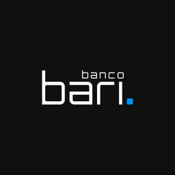 | 0330 | 00556603 | BANCO BARI S.A. | URL direta (revisada) |
|  | 0332 | 13140088 | ACESSO SOLUÇÕES DE PAGAMENTO S.A. - INSTITUIÇÃO DE PAGAMENTO | Open Finance — ACESSO SOLUCOES PAGAMENTO SA |
|  | 0335 | 27098060 | BANCO DIGIO | Open Finance — BANCO DIGIO |
|  | 0336 | 31872495 | BCO C6 S.A. | Open Finance — BCO C6 S.A. |
|  | 0341 | 60701190 | ITAÚ UNIBANCO S.A. | Open Finance — ITAU UNIBANCO S.A. |
|  | 0348 | 33264668 | BCO XP S.A. | Open Finance — BANCO XP S.A. |
|  | 0352 | 29162769 | SANTANDER CTVM S.A. | Open Finance — Santander CTVM S.A. |
|  | 0358 | 09464032 | MIDWAY S.A. - SCFI | Open Finance — MIDWAY S.A. - SCFI |
| 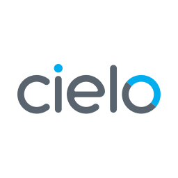 | 0362 | 01027058 | CIELO IP S.A. | Open Finance — CIELO S.A. |
|  | 0363 | 62285390 | QI CTVM S.A. | Open Finance — QI SCD S.A. |
| 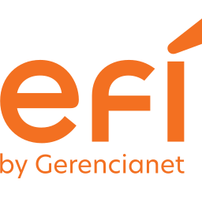 | 0364 | 09089356 | EFÍ S.A. - IP | Open Finance — EFI S.A. - INSTITUICAO DE PAGAMENTO |
| 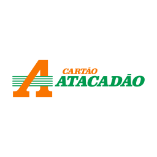 | 0368 | 08357240 | BCO CSF S.A. | Open Finance — BANCO CSF S/A |
|  | 0370 | 61088183 | BCO MIZUHO S.A. | URL direta (revisada) |
|  | 0374 | 27351731 | REALIZE SCFI S.A. | Open Finance — REALIZE SOCIEDADE DE CREDITO, FINANCIAMENTO E INVESTIMENTO S.A. |
|  | 0376 | 33172537 | BCO J.P. MORGAN S.A. | URL direta (revisada) |
|  | 0380 | 22896431 | PICPAY | Open Finance — PICPAY |
|  | 0381 | 60814191 | BCO MERCEDES-BENZ S.A. | URL direta (revisada) |
| 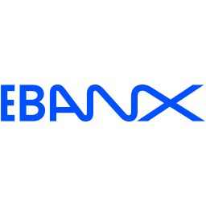 | 0383 | 21018182 | EBANX IP LTDA. | Open Finance — Ebanx Instituicao de Pagamento Ltda. |
|  | 0386 | 30680829 | NU FINANCEIRA S.A. CFI | Open Finance — NU PAGAMENTOS S.A. - INSTITUICAO DE PAGAMENTO |
|  | 0389 | 17184037 | BCO MERCANTIL DO BRASIL S.A. | Open Finance — BCO MERCANTIL DO BRASIL S.A. |
|  | 0393 | 59109165 | BCO VOLKSWAGEN S.A | URL direta (revisada) |
| 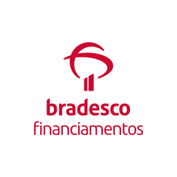 | 0394 | 07207996 | BCO BRADESCO FINANC. S.A. | Open Finance — BCO BRADESCO FINANC. S.A. |
|  | 0396 | 13884775 | MAGALUPAY | Open Finance — Magalupay Instituicao de Pagamento S.A. |
|  | 0397 | 34088029 | LISTO SCD S.A. | Open Finance — LISTO SOCIEDADE DE CREDITO DIRETO S.A. |
|  | 0401 | 15111975 | IUGU IP S.A. | Open Finance — IUGU INSTITUICAO DE PAGAMENTO S.A. |
|  | 0403 | 37880206 | CORA SCFI | Open Finance — CORA SCD S.A. |
|  | 0404 | 37241230 | SUMUP SCD S.A. | Open Finance — SUMUP SCD S.A. |
|  | 0406 | 37715993 | ACCREDITO SCD S.A. | Open Finance — ACCREDITO - SOCIEDADE DE CREDITO DIRETO S.A. |
|  | 0407 | 00329598 | SEFER INVESTIMENTOS DTVM LTDA - EM LIQUIDAÇÃO EXTRAJUDICIAL | Open Finance — SEFER INVESTIMENTOS DTVM LTDA |
|  | 0412 | 15173776 | SOCIAL BANK S/A | URL direta (revisada) |
|  | 0413 | 01858774 | BCO BV S.A. | Open Finance — BCO VOTORANTIM S.A. |
| 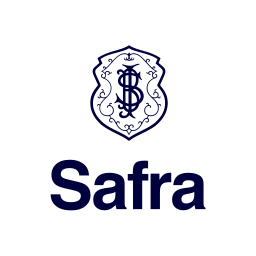 | 0422 | 58160789 | BCO SAFRA S.A. | Open Finance — BCO SAFRA S.A. |
|  | 0426 | 11285104 | NEON FINANCEIRA - SCFI S.A. | Open Finance — Neon Pagamentos |
|  | 0428 | 39664698 | CREDSYSTEM SCD S.A. | Open Finance — CRED SYSTEM SOCIEDADE DE CREDITO DIRETO SA |
|  | 0450 | 13203354 | FITS IP | Open Finance — FITS INSTITUICAO DE PAGAMENTO S.A. |
|  | 0461 | 19540550 | ASAAS IP S.A. | Open Finance — ASAAS GESTAO FINANCEIRA INSTITUICAO DE PAGAMENTO S.A. |
|  | 0469 | 07138049 | PICPAY INVEST | Open Finance — PICPAY |
|  | 0477 | 33042953 | CITIBANK N.A. | Open Finance — BCO CITIBANK S.A. |
|  | 0479 | 60394079 | BCO ITAUBANK S.A. | Open Finance — ITAU UNIBANCO S.A. |
|  | 0487 | 62331228 | DEUTSCHE BANK S.A.BCO ALEMAO | URL direta (revisada) |
|  | 0488 | 46518205 | JPMORGAN CHASE BANK | URL direta (revisada) |
|  | 0505 | 32062580 | BCO UBS BRASIL | URL direta (revisada) |
|  | 0507 | 37229413 | SCFI EFÍ S.A. | Open Finance — EFI S.A. - INSTITUICAO DE PAGAMENTO |
| 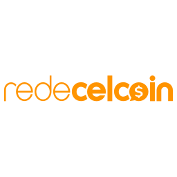 | 0509 | 13935893 | CELCOIN IP S.A. | Open Finance — CELCOIN INSTITUICAO DE PAGAMENTO S.A. |
| 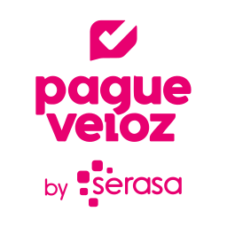 | 0517 | 03816413 | PAGUEVELOZ IP LTDA. | Open Finance — PAGUEVELOZ INSTITUICAO DE PAGAMENTO LTDA |
|  | 0518 | 37679449 | MERCADO CRÉDITO SCFI S.A. | Open Finance — MERCADO PAGO INSTITUICAO DE PAGAMENTO LTDA |
|  | 0534 | 00714671 | EWALLY IP S.A. | URL direta (revisada) |
|  | 0536 | 20855875 | NEON PAGAMENTOS S.A. IP | Open Finance — Neon Pagamentos |
|  | 0541 | 00954288 | FDO GARANTIDOR CRÉDITOS | URL direta (revisada) |
|  | 0542 | 18189547 | CLOUDWALK IP LTDA | Open Finance — CLOUDWALK INSTITUICAO DE PAGAMENTO E SERVICOS LTDA |
|  | 0555 | 02682287 | PAN FINAN | Open Finance — BANCO PAN |
|  | 0565 | 74014747 | ÁGORA CTVM S.A. | Open Finance — AGORA CTVM S.A. |
| 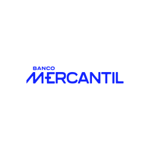 | 0567 | 33040601 | MERCANTIL FINANCEIRA | Open Finance — BCO MERCANTIL DO BRASIL S.A. |
|  | 0576 | 11351086 | MERCADO BITCOIN IP LTDA | Open Finance — MERCADO BITCOIN INSTITUICAO DE PAGAMENTO LTDA |
|  | 0580 | 87437687 | CCCPOUPINV SUL E SUDESTE - CENTRAL SUL/SUDESTE | Open Finance — CONFEDERACAO DAS COOPERATIVAS DO SICREDI - CONFEDERACAO SICREDI |
|  | 0581 | 70119680 | CENTRAL NORDESTE | Open Finance — CONFEDERACAO DAS COOPERATIVAS DO SICREDI - CONFEDERACAO SICREDI |
|  | 0582 | 33737818 | CCC POUP INV DE MS, GO, DF E TO | Open Finance — CONFEDERACAO DAS COOPERATIVAS DO SICREDI - CONFEDERACAO SICREDI |
|  | 0583 | 33667205 | CCC POUP INV DO CENTRO NORTE DO BRASIL | Open Finance — CONFEDERACAO DAS COOPERATIVAS DO SICREDI - CONFEDERACAO SICREDI |
|  | 0584 | 80230774 | CCC POUP E INV DOS ESTADOS DO PR, SP E RJ | Open Finance — CONFEDERACAO DAS COOPERATIVAS DO SICREDI - CONFEDERACAO SICREDI |
| 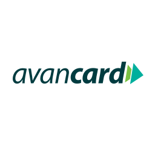 | 0588 | 20308187 | AVANCARD PROVER IP LTDA | Open Finance — PROVER PROMOCAO DE VENDAS INSTITUICAO DE PAGAMENTO LTDA |
|  | 0594 | 48703388 | ASA SCFI S.A. | Open Finance — ASA SOCIEDADE DE CREDITO FINANCIAMENTO E INVESTIMENTO S.A. |
|  | 0595 | 19468242 | IFOOD PAGO IP | Open Finance — IFood Pago Instituicao de Pagamento S.A. |
| 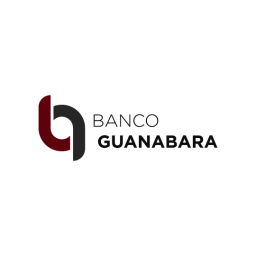 | 0612 | 31880826 | BCO GUANABARA S.A. | Open Finance — BCO GUANABARA S.A. |
|  | 0613 | 60850229 | OMNI BANCO S.A. | URL direta (revisada) |
|  | 0620 | 51342763 | REVOLUT SCD S.A. | Open Finance — REVOLUT SOCIEDADE DE CREDITO DIRETO S.A. |
|  | 0623 | 59285411 | BANCO PAN | Open Finance — BANCO PAN |
|  | 0626 | 61348538 | BCO C6 CONSIG | Open Finance — BCO C6 S.A. |
|  | 0633 | 68900810 | BCO RENDIMENTO S.A. | Open Finance — BCO RENDIMENTO S.A. |
| 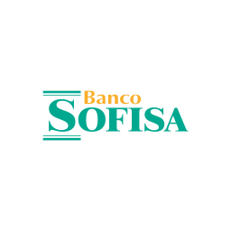 | 0637 | 60889128 | BCO SOFISA S.A. | Open Finance — BCO SOFISA S.A. |
| 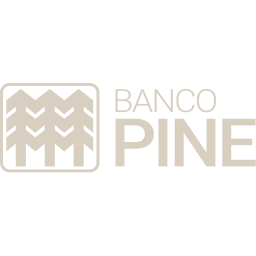 | 0643 | 62144175 | BCO PINE S.A. | URL direta (revisada) |
|  | 0655 | 59588111 | BCO VOTORANTIM S.A. | Open Finance — BCO VOTORANTIM S.A. |
|  | 0668 | 48632754 | CELCOIN SCD | Open Finance — CELCOIN INSTITUICAO DE PAGAMENTO S.A. |
|  | 0672 | 53505601 | STONE CFI S.A. | Open Finance — STONE PAGAMENTOS S.A. |
| 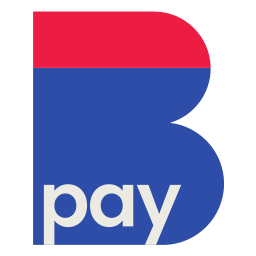 | 0675 | 30723871 | CASAS BAHIA PAY IP LTDA. | Open Finance — CASAS BAHIA PAY INSTITUICAO DE PAGAMENTO LTDA |
|  | 0694 | 54811417 | WOOVI IP LTDA. | URL direta (revisada) |
|  | 0703 | 10440482 | GETNET IP | Open Finance — GETNET ADQUIRENCIA E SERVICOS PARA MEIOS DE PAGAMENTO S A |
|  | 0712 | 78632767 | OURIBANK S.A. | URL direta (revisada) |
| 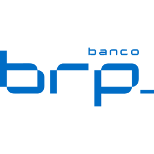 | 0741 | 00517645 | BCO RIBEIRAO PRETO S.A. | Open Finance — BCO RIBEIRAO PRETO S.A. |
| 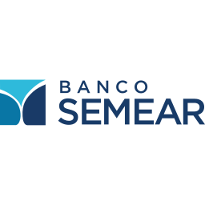 | 0743 | 00795423 | BANCO SEMEAR | Open Finance — BANCO SEMEAR |
|  | 0745 | 33479023 | BCO CITIBANK S.A. | Open Finance — BCO CITIBANK S.A. |
|  | 0748 | 01181521 | BCO COOPERATIVO SICREDI S.A. | Open Finance — CONFEDERACAO DAS COOPERATIVAS DO SICREDI - CONFEDERACAO SICREDI |
|  | 0756 | 02038232 | BANCO SICOOB S.A. | Open Finance — Confederacao Nacional das Cooperativas do Sicoob |
|  | 0769 | 24313102 | 99PAY IP S.A. | Open Finance — 99PAY INSTITUICAO DE PAGAMENTO S.A. |
|  | 0773 | 53908413 | KIWIFY IP | URL direta (revisada) |
|  | 0775 | 47381104 | CONTAAZUL IP LTDA. | URL direta (revisada) |
|  | 0783 | 31680151 | SWAP IP S.A. | Open Finance — Swap Meios de Pagamentos Instituicao de Pagamento S.A. |
|  | 0793 | 61021673 | MAGALUPAY SCFI S.A. | Open Finance — Magalupay Instituicao de Pagamento S.A. |
|  | — | 00075847 | CC UNICRED CENTRO-SUL LTDA - UNICRED CENTRO-SUL | Open Finance — COOPERATIVA CENTRAL DE CREDITO UNICRED DO BRASIL - UNICRED DO BRASIL |
|  | — | 00259231 | CCLA SICOOB UNIMAIS METROPOLITANA | Open Finance — Confederacao Nacional das Cooperativas do Sicoob |
|  | — | 00694389 | CCLA SICOOB CREDICARU SC/RS | Open Finance — Confederacao Nacional das Cooperativas do Sicoob |
|  | — | 00694877 | COOP SICOOB EXECUTIVO LTDA. | Open Finance — Confederacao Nacional das Cooperativas do Sicoob |
|  | — | 00804046 | COOP CREDICAPI LTDA - SICOOB CREDICAPI | Open Finance — Confederacao Nacional das Cooperativas do Sicoob |
|  | — | 00815319 | SICOOB SUL-SERRANO | Open Finance — Confederacao Nacional das Cooperativas do Sicoob |
|  | — | 00952415 | SICOOB CREDFAZ | Open Finance — Confederacao Nacional das Cooperativas do Sicoob |
|  | — | 00968602 | COOP SICOOB COOPERCRED LTDA. | Open Finance — Confederacao Nacional das Cooperativas do Sicoob |
|  | — | 00971300 | COOP CRESOL PIONEIRA | Open Finance — CRESOL CONFEDERAÇÃO |
|  | — | 01039011 | CC UNICRED DESBRAVADORA LTDA - UNICRED DESBRAVADORA | Open Finance — COOPERATIVA CENTRAL DE CREDITO UNICRED DO BRASIL - UNICRED DO BRASIL |
|  | — | 01155801 | COOP CRESOL CENTRO SERRA | Open Finance — CRESOL CONFEDERAÇÃO |
|  | — | 01205736 | COOP DE CRÉDITO SICOOB COSTA DO DESCOBRIMENTO LTDA. | Open Finance — Confederacao Nacional das Cooperativas do Sicoob |
|  | — | 01259518 | COOP SICOOB UNIMAIS CLP | Open Finance — Confederacao Nacional das Cooperativas do Sicoob |
|  | — | 01526924 | UNICRED HORIZONTES | Open Finance — COOPERATIVA CENTRAL DE CREDITO UNICRED DO BRASIL - UNICRED DO BRASIL |
|  | — | 01604998 | CCLA SUL MINAS-SICOOB CREDIVAS | Open Finance — Confederacao Nacional das Cooperativas do Sicoob |
|  | — | 01635462 | UNICRED PREMIUM CAPITAL | Open Finance — COOPERATIVA CENTRAL DE CREDITO UNICRED DO BRASIL - UNICRED DO BRASIL |
|  | — | 01644264 | CCLA SICOOB CREDIMEPI | Open Finance — Confederacao Nacional das Cooperativas do Sicoob |
|  | — | 01667352 | CCLA SICOOB CREDMISSÃO LTDA. | Open Finance — Confederacao Nacional das Cooperativas do Sicoob |
|  | — | 01667766 | CCLA CREDINOVA LTDA. - SICOOB CREDINOVA | Open Finance — Confederacao Nacional das Cooperativas do Sicoob |
|  | — | 01705236 | UNICRED PROSPERAR | Open Finance — COOPERATIVA CENTRAL DE CREDITO UNICRED DO BRASIL - UNICRED DO BRASIL |
|  | — | 01722480 | QUERO-QUERO VERDECARD IP S.A. | Open Finance — QUERO-QUERO VERDECARD INSTITUICAO DE PAGAMENTO S.A. |
|  | — | 01727929 | CC UNICRED EVOLUÇÃO LTDA. | Open Finance — COOPERATIVA CENTRAL DE CREDITO UNICRED DO BRASIL - UNICRED DO BRASIL |
|  | — | 02015588 | COOP SICOOB CREDIP | Open Finance — Confederacao Nacional das Cooperativas do Sicoob |
|  | — | 02057584 | CC SICOOB SERTÃO | Open Finance — Confederacao Nacional das Cooperativas do Sicoob |
|  | — | 02072790 | CECM SICOOB CREDSAÚDE | Open Finance — Confederacao Nacional das Cooperativas do Sicoob |
|  | — | 02090126 | CCLA SICOOB VALCREDI SUL | Open Finance — Confederacao Nacional das Cooperativas do Sicoob |
|  | — | 02179673 | COOPERATIVA DE CRÉDITO LIVRE ADMISSÃO SICOOB OURICRED | Open Finance — Confederacao Nacional das Cooperativas do Sicoob |
|  | — | 02254376 | CCLA SICOOB COOPCREDI | Open Finance — Confederacao Nacional das Cooperativas do Sicoob |
|  | — | 02275781 | CCM SERV FEDERAIS NA PARAÍBA - SICOOB COOPERCRET | Open Finance — Confederacao Nacional das Cooperativas do Sicoob |
|  | — | 02282165 | CC SICOOB CREDICONQUISTA | Open Finance — Confederacao Nacional das Cooperativas do Sicoob |
|  | — | 02382755 | SICOOB POTIGUAR | Open Finance — Confederacao Nacional das Cooperativas do Sicoob |
|  | — | 02446089 | COOP CRESOL UNIAO | Open Finance — CRESOL CONFEDERAÇÃO |
|  | — | 02447120 | CC SICOOB EXTREMO SUL LTDA. | Open Finance — Confederacao Nacional das Cooperativas do Sicoob |
|  | — | 02448310 | COOP CRESOL PROGRESSO | Open Finance — CRESOL CONFEDERAÇÃO |
|  | — | 02448839 | SICOOB CREDIUNIÃO | Open Finance — Confederacao Nacional das Cooperativas do Sicoob |
|  | — | 02466552 | CC SICOOB VALE SUL | Open Finance — Confederacao Nacional das Cooperativas do Sicoob |
|  | — | 02493000 | SICOOB LESTE | Open Finance — Confederacao Nacional das Cooperativas do Sicoob |
|  | — | 02528151 | CC SICOOB CREDCOOP | Open Finance — Confederacao Nacional das Cooperativas do Sicoob |
|  | — | 02663426 | COOP CRESOL NOROESTE | Open Finance — CRESOL CONFEDERAÇÃO |
|  | — | 02766672 | COOP CRESOL EXCELÊNCIA | Open Finance — CRESOL CONFEDERAÇÃO |
|  | — | 02794761 | SICOOB UFVCREDI | Open Finance — Confederacao Nacional das Cooperativas do Sicoob |
|  | — | 02833202 | UNICRED SUDOESTE DA BAHIA | Open Finance — COOPERATIVA CENTRAL DE CREDITO UNICRED DO BRASIL - UNICRED DO BRASIL |
|  | — | 02843443 | COOP SICREDI NORTE SC | Open Finance — CONFEDERACAO DAS COOPERATIVAS DO SICREDI - CONFEDERACAO SICREDI |
|  | — | 02844024 | COOP CRESOL EVOLUÇAO | Open Finance — CRESOL CONFEDERAÇÃO |
|  | — | 02876918 | CC SICOOB NORTE SUL | Open Finance — Confederacao Nacional das Cooperativas do Sicoob |
|  | — | 02904125 | COOP CRESOL JACUTINGA | Open Finance — CRESOL CONFEDERAÇÃO |
|  | — | 02904138 | COOP CRESOL ÁUREA | Open Finance — CRESOL CONFEDERAÇÃO |
|  | — | 02910987 | COOP CRESOL CENTRO SUL | Open Finance — CRESOL CONFEDERAÇÃO |
|  | — | 02923389 | COOP SICREDI SERIGY SE/BA | Open Finance — CONFEDERACAO DAS COOPERATIVAS DO SICREDI - CONFEDERACAO SICREDI |
|  | — | 02924977 | COOP SICREDI MEDICRED | Open Finance — CONFEDERACAO DAS COOPERATIVAS DO SICREDI - CONFEDERACAO SICREDI |
|  | — | 02931668 | SICOOB FLUMINENSE | Open Finance — Confederacao Nacional das Cooperativas do Sicoob |
|  | — | 02934201 | COOP CRESOL LIDERANCA | Open Finance — CRESOL CONFEDERAÇÃO |
|  | — | 02935307 | CC SICOOB CREDSEGURO LTDA. | Open Finance — Confederacao Nacional das Cooperativas do Sicoob |
|  | — | 03000142 | COOP POL FED - SICREDI POL | Open Finance — CONFEDERACAO DAS COOPERATIVAS DO SICREDI - CONFEDERACAO SICREDI |
|  | — | 03015152 | COOP CRESOL SÃO VALENTIM | Open Finance — CRESOL CONFEDERAÇÃO |
|  | — | 03042597 | COOP SICREDI CAMPO GRANDE MS/GO | Open Finance — CONFEDERACAO DAS COOPERATIVAS DO SICREDI - CONFEDERACAO SICREDI |
|  | — | 03065046 | COOP SICREDI NOROESTE SP | Open Finance — CONFEDERACAO DAS COOPERATIVAS DO SICREDI - CONFEDERACAO SICREDI |
|  | — | 03102185 | CCLA CENTRO NORDESTE - SICOOB CENTRO NORDESTE | Open Finance — Confederacao Nacional das Cooperativas do Sicoob |
|  | — | 03130170 | BRASIL CARD IP LTDA | Open Finance — BRASIL CARD INSTITUICAO DE PAGAMENTOS LTDA |
|  | — | 03212823 | COOP SICREDI TRADIÇÃO RS | Open Finance — CONFEDERACAO DAS COOPERATIVAS DO SICREDI - CONFEDERACAO SICREDI |
|  | — | 03320525 | COOP ARACOOP LTDA. - SICOOB ARACOOP | Open Finance — Confederacao Nacional das Cooperativas do Sicoob |
|  | — | 03358914 | SICOOB CREDIROCHAS | Open Finance — Confederacao Nacional das Cooperativas do Sicoob |
|  | — | 03428338 | COOP SICOOB CREDUNI | Open Finance — Confederacao Nacional das Cooperativas do Sicoob |
|  | — | 03459850 | CC SICOOB METROPOLITANO | Open Finance — Confederacao Nacional das Cooperativas do Sicoob |
|  | — | 03485130 | COOP CRESOL ENCOSTAS DA SERRA GERAL | Open Finance — CRESOL CONFEDERAÇÃO |
|  | — | 03535065 | CC SICOOB CREDMETAL | Open Finance — Confederacao Nacional das Cooperativas do Sicoob |
|  | — | 03566655 | COOP SICREDI CELEIRO OESTE | Open Finance — CONFEDERACAO DAS COOPERATIVAS DO SICREDI - CONFEDERACAO SICREDI |
|  | — | 03603683 | COOP SICOOB COOPERPLAN CREDSEF | Open Finance — Confederacao Nacional das Cooperativas do Sicoob |
|  | — | 03620772 | CCM DO CEARÁ - SICOOB CEARÁ | Open Finance — Confederacao Nacional das Cooperativas do Sicoob |
|  | — | 03632872 | SICOOB CREDISUL | Open Finance — Confederacao Nacional das Cooperativas do Sicoob |
|  | — | 03662047 | COOP SICREDI MP | Open Finance — CONFEDERACAO DAS COOPERATIVAS DO SICREDI - CONFEDERACAO SICREDI |
|  | — | 03732359 | CCLA DE PERNAMBUCO - SICOOB PERNAMBUCO | Open Finance — Confederacao Nacional das Cooperativas do Sicoob |
|  | — | 03750034 | COOP SICREDI AJURIS | Open Finance — CONFEDERACAO DAS COOPERATIVAS DO SICREDI - CONFEDERACAO SICREDI |
|  | — | 03793242 | COOP SICREDI SUL SC | Open Finance — CONFEDERACAO DAS COOPERATIVAS DO SICREDI - CONFEDERACAO SICREDI |
|  | — | 03862898 | CCLA EMPREG DOS CORREIOS - SICOOB COOPERCORREIOS | Open Finance — Confederacao Nacional das Cooperativas do Sicoob |
|  | — | 03965737 | COOP CRESOL VANGUARDA | Open Finance — CRESOL CONFEDERAÇÃO |
|  | — | 04013172 | CC SICOOB 3 COLINAS | Open Finance — Confederacao Nacional das Cooperativas do Sicoob |
|  | — | 04079285 | CCLA DE ITAJUBÁ - SICOOB SUDESTE MAIS | Open Finance — Confederacao Nacional das Cooperativas do Sicoob |
|  | — | 04120633 | SICOOB EMPRESAS RJ | Open Finance — Confederacao Nacional das Cooperativas do Sicoob |
|  | — | 04174720 | CC SICOOB COOPEMAR | Open Finance — Confederacao Nacional das Cooperativas do Sicoob |
|  | — | 04237413 | COOP SICREDI NATIVA PE/BA | Open Finance — CONFEDERACAO DAS COOPERATIVAS DO SICREDI - CONFEDERACAO SICREDI |
|  | — | 04243780 | CENTRAL SICOOB UNI DE CC | Open Finance — Confederacao Nacional das Cooperativas do Sicoob |
|  | — | 04261151 | COOP CRESOL TRANSFORMAÇÃO | Open Finance — CRESOL CONFEDERAÇÃO |
|  | — | 04321309 | CC SICOOB INOVA | Open Finance — Confederacao Nacional das Cooperativas do Sicoob |
|  | — | 04350225 | COOP CRESOL TRADICAO | Open Finance — CRESOL CONFEDERAÇÃO |
|  | — | 04355489 | CC UNICRED COOMARCA | Open Finance — COOPERATIVA CENTRAL DE CREDITO UNICRED DO BRASIL - UNICRED DO BRASIL |
|  | — | 04388688 | CC SICOOB ENGECRED | Open Finance — Confederacao Nacional das Cooperativas do Sicoob |
|  | — | 04445917 | UNICRED COALIZÃO | Open Finance — COOPERATIVA CENTRAL DE CREDITO UNICRED DO BRASIL - UNICRED DO BRASIL |
|  | — | 04463602 | COOP SICREDI CEN OEST PAULISTA | Open Finance — CONFEDERACAO DAS COOPERATIVAS DO SICREDI - CONFEDERACAO SICREDI |
|  | — | 04484490 | COOP SICREDI ALTA NOROESTE SP | Open Finance — CONFEDERACAO DAS COOPERATIVAS DO SICREDI - CONFEDERACAO SICREDI |
|  | — | 04490531 | COOP CRESOL GOIAS | Open Finance — CRESOL CONFEDERAÇÃO |
|  | — | 04525997 | COOP SICREDI EDUCAÇÃO RS | Open Finance — CONFEDERACAO DAS COOPERATIVAS DO SICREDI - CONFEDERACAO SICREDI |
|  | — | 04529074 | COOP SICOOB CREDICAPITAL | Open Finance — Confederacao Nacional das Cooperativas do Sicoob |
|  | — | 04565791 | COOP CRESOL ARATIBA | Open Finance — CRESOL CONFEDERAÇÃO |
|  | — | 04649337 | COOP SICOOB BRMIL LTDA. | Open Finance — Confederacao Nacional das Cooperativas do Sicoob |
|  | — | 04751713 | CC INV DE RONDÔNIA - SICOOB CREDJURD | Open Finance — Confederacao Nacional das Cooperativas do Sicoob |
|  | — | 04833655 | CECM SICOOB METALCRED | Open Finance — Confederacao Nacional das Cooperativas do Sicoob |
|  | — | 04853988 | COOP SICREDI BANDEIRANTES | Open Finance — CONFEDERACAO DAS COOPERATIVAS DO SICREDI - CONFEDERACAO SICREDI |
|  | — | 04886317 | COOP SICREDI CREDJURIS | Open Finance — CONFEDERACAO DAS COOPERATIVAS DO SICREDI - CONFEDERACAO SICREDI |
|  | — | 05036532 | CCC UNICOOB-SICOOB CENTR UNIC | Open Finance — Confederacao Nacional das Cooperativas do Sicoob |
|  | — | 05070112 | COOP CRESOL INOVAÇAO | Open Finance — CRESOL CONFEDERAÇÃO |
|  | — | 05203605 | SICOOB AMAZÔNIA | Open Finance — Confederacao Nacional das Cooperativas do Sicoob |
|  | — | 05220243 | COOP CRESOL ORIGENS | Open Finance — CRESOL CONFEDERAÇÃO |
|  | — | 05222094 | COOP SICOOB CERRADO | Open Finance — Confederacao Nacional das Cooperativas do Sicoob |
|  | — | 05231945 | COOP CRESOL UNIAO DOS VALES | Open Finance — CRESOL CONFEDERAÇÃO |
|  | — | 05241145 | COOP CRESOL CAMINHOS | Open Finance — CRESOL CONFEDERAÇÃO |
|  | — | 05241619 | COOP SICOOB PRIMAVERA | Open Finance — Confederacao Nacional das Cooperativas do Sicoob |
|  | — | 05247312 | COOP SICOOB BURITIS | Open Finance — Confederacao Nacional das Cooperativas do Sicoob |
|  | — | 05269976 | COOP CRESOL MAIS | Open Finance — CRESOL CONFEDERAÇÃO |
|  | — | 05276770 | COOP CRESOL FRONTEIRAS PR/SC/SP/ES | Open Finance — CRESOL CONFEDERAÇÃO |
|  | — | 05277312 | COOP CRESOL HORIZONTE | Open Finance — CRESOL CONFEDERAÇÃO |
|  | — | 05410056 | COOP CRESOL LITORAL | Open Finance — CRESOL CONFEDERAÇÃO |
|  | — | 05425526 | COOP CRESOL DESENVOLVIMENTO | Open Finance — CRESOL CONFEDERAÇÃO |
|  | — | 05477038 | CC NO PIAUÍ - SICOOB PIAUÍ | Open Finance — Confederacao Nacional das Cooperativas do Sicoob |
|  | — | 05494591 | COOP CRESOL NASCENTE | Open Finance — CRESOL CONFEDERAÇÃO |
|  | — | 05545390 | COOP SICREDI LENÇÓIS | Open Finance — CONFEDERACAO DAS COOPERATIVAS DO SICREDI - CONFEDERACAO SICREDI |
|  | — | 05582619 | CC SICOOB OURO VERDE | Open Finance — Confederacao Nacional das Cooperativas do Sicoob |
|  | — | 05856736 | SICOOB EMPRESARIAL | Open Finance — Confederacao Nacional das Cooperativas do Sicoob |
| 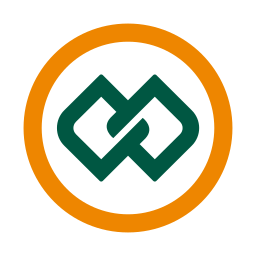 | — | 05863726 | COOP CRESOL PLANALTO SERRA SUL | Open Finance — CRESOL CONFEDERAÇÃO |
|  | — | 05983995 | COOP CRESOL COOPERAR | Open Finance — CRESOL CONFEDERAÇÃO |
|  | — | 06031727 | COOP CRESOL ESSENCIA | Open Finance — CRESOL CONFEDERAÇÃO |
|  | — | 06078926 | COOP SICREDI CREDENOREG | Open Finance — CONFEDERACAO DAS COOPERATIVAS DO SICREDI - CONFEDERACAO SICREDI |
|  | — | 06126780 | COOP CRESOL GRANDES LAGOS PR/SP | Open Finance — CRESOL CONFEDERAÇÃO |
|  | — | 06139650 | COOP CRESOL RIO GRANDE DO SUL | Open Finance — CRESOL CONFEDERAÇÃO |
|  | — | 06174009 | CC SICOOB ALIANÇA | Open Finance — Confederacao Nacional das Cooperativas do Sicoob |
|  | — | 06332931 | COOP SICREDI CERRADO GO | Open Finance — CONFEDERACAO DAS COOPERATIVAS DO SICREDI - CONFEDERACAO SICREDI |
|  | — | 07026923 | CCLA SICOOB ARENITO PARANÁ / SÃO PAULO | Open Finance — Confederacao Nacional das Cooperativas do Sicoob |
|  | — | 07070495 | COOP SICREDI EMPREENDEDORES | Open Finance — CONFEDERACAO DAS COOPERATIVAS DO SICREDI - CONFEDERACAO SICREDI |
|  | — | 07097064 | COOP SICOOB CONFIANÇA | Open Finance — Confederacao Nacional das Cooperativas do Sicoob |
|  | — | 07122321 | CC INTEGRADO - SICOOB INTEGRADO | Open Finance — Confederacao Nacional das Cooperativas do Sicoob |
|  | — | 07194313 | CC SICOOB HORIZONTE | Open Finance — Confederacao Nacional das Cooperativas do Sicoob |
|  | — | 07206072 | COOP SICREDI NOVOS HORIZONTES PR/SP/RJ | Open Finance — CONFEDERACAO DAS COOPERATIVAS DO SICREDI - CONFEDERACAO SICREDI |
|  | — | 07215632 | COOP CRESOL ALTERNATIVA | Open Finance — CRESOL CONFEDERAÇÃO |
|  | — | 07252614 | COOP CRESOL CONFIANÇA | Open Finance — CRESOL CONFEDERAÇÃO |
|  | — | 07268499 | COOP CRESOL INTEGRACAO | Open Finance — CRESOL CONFEDERAÇÃO |
|  | — | 07318874 | COOP  SICOOB MÉDIO OESTE | Open Finance — Confederacao Nacional das Cooperativas do Sicoob |
|  | — | 07320890 | COOP CRESOL VALE | Open Finance — CRESOL CONFEDERAÇÃO |
|  | — | 07412987 | COOP CRESOL ALIANÇA | Open Finance — CRESOL CONFEDERAÇÃO |
|  | — | 07465539 | COOP CRESOL ALTO VALE | Open Finance — CRESOL CONFEDERAÇÃO |
|  | — | 07509426 | COOP CRESOL XANXERE | Open Finance — CRESOL CONFEDERAÇÃO |
|  | — | 07512780 | COOP CRESOL VALE EUROPEU | Open Finance — CRESOL CONFEDERAÇÃO |
|  | — | 07669921 | CCM SICOOB CREDIACISC | Open Finance — Confederacao Nacional das Cooperativas do Sicoob |
|  | — | 07925729 | COOP CRESOL NORTE PARANAENSE | Open Finance — CRESOL CONFEDERAÇÃO |
|  | — | 07946216 | CCLA SICOOB UNIÃO SUDESTE | Open Finance — Confederacao Nacional das Cooperativas do Sicoob |
|  | — | 07946451 | COOP CRESOL ATIVA | Open Finance — CRESOL CONFEDERAÇÃO |
|  | — | 07958405 | COOP CRESOL SERRA MAR | Open Finance — CRESOL CONFEDERAÇÃO |
|  | — | 08041950 | COOP SICREDI COOPERJURIS | Open Finance — CONFEDERACAO DAS COOPERATIVAS DO SICREDI - CONFEDERACAO SICREDI |
|  | — | 08044854 | COOP SICOOB CENTRO | Open Finance — Confederacao Nacional das Cooperativas do Sicoob |
|  | — | 08055016 | COOP CRESOL INTERAÇÃO | Open Finance — CRESOL CONFEDERAÇÃO |
|  | — | 08071414 | CECM SICOOB COOPERAC | Open Finance — Confederacao Nacional das Cooperativas do Sicoob |
|  | — | 08488377 | COOP CRESOL MISSÕES FRONTEIRA RS | Open Finance — CRESOL CONFEDERAÇÃO |
|  | — | 08560508 | COOP CRESOL TRIUNFO | Open Finance — CRESOL CONFEDERAÇÃO |
|  | — | 08624548 | COOP CRESOL MINAS GERAIS | Open Finance — CRESOL CONFEDERAÇÃO |
|  | — | 08742188 | CCLA UNIÃO E NEGÓCIOS  - SICOOB INTEGRAÇÃO | Open Finance — Confederacao Nacional das Cooperativas do Sicoob |
|  | — | 08795285 | CCLA SICOOB CREDIACIL | Open Finance — Confederacao Nacional das Cooperativas do Sicoob |
|  | — | 08844074 | CC DE ITAPETININGA - SICOOB CRED-ACI | Open Finance — Confederacao Nacional das Cooperativas do Sicoob |
|  | — | 09004796 | CECM SICOOB CRED-ACILPA | Open Finance — Confederacao Nacional das Cooperativas do Sicoob |
|  | — | 09330158 | COOP CRESOL TREZE DE MAIO | Open Finance — CRESOL CONFEDERAÇÃO |
|  | — | 09343038 | COOP SICREDI ALTSERTÃO PARAIBANO | Open Finance — CONFEDERACAO DAS COOPERATIVAS DO SICREDI - CONFEDERACAO SICREDI |
|  | — | 09403026 | CC CENTRO LESTE NORTE MARANHENSE - SICOOB CENTROLESTE | Open Finance — Confederacao Nacional das Cooperativas do Sicoob |
|  | — | 09424988 | CCLA DO OESTE MARANHENSE - SICOOB OESTE MARANHENSE | Open Finance — Confederacao Nacional das Cooperativas do Sicoob |
|  | — | 09463721 | COOP CRESOL JACINTO MACHADO | Open Finance — CRESOL CONFEDERAÇÃO |
|  | — | 09488496 | COOP CRESOL COOPERACRED | Open Finance — CRESOL CONFEDERAÇÃO |
|  | — | 10262276 | CCLA DO ESTADO DE SÃO PAULO - SICOOB PAULISTA | Open Finance — Confederacao Nacional das Cooperativas do Sicoob |
|  | — | 10348181 | COOP SICREDI VALE LITORAL SC | Open Finance — CONFEDERACAO DAS COOPERATIVAS DO SICREDI - CONFEDERACAO SICREDI |
|  | — | 10520232 | COOP CRESOL AMAZONIA | Open Finance — CRESOL CONFEDERAÇÃO |
|  | — | 10736214 | COOP SICREDI PLAN CENTRAL | Open Finance — CONFEDERACAO DAS COOPERATIVAS DO SICREDI - CONFEDERACAO SICREDI |
|  | — | 11275560 | RECARGAPAY IP LTDA. | Open Finance — RECARGAPAY INSTITUICAO DE PAGAMENTO LTDA. |
|  | — | 11907520 | CCLA DA PARAÍBA - SICOOB PARAÍBA | Open Finance — Confederacao Nacional das Cooperativas do Sicoob |
|  | — | 11969853 | COOP CRESOL CONEXÃO | Open Finance — CRESOL CONFEDERAÇÃO |
|  | — | 14568725 | COOPCENTRAL DE ECON. E CRÉDITO SICOOB UNIMAIS RIO LTDA. | Open Finance — Confederacao Nacional das Cooperativas do Sicoob |
|  | — | 14913919 | CC MERCADO IMOBILIÁRIO - SICOOB IMOB.VC | Open Finance — Confederacao Nacional das Cooperativas do Sicoob |
|  | — | 16564240 | CECM APOS PENS E IDOSOS - SICOOB COOPERNAPI | Open Finance — Confederacao Nacional das Cooperativas do Sicoob |
|  | — | 17343510 | COOP CRESOL RAIZ | Open Finance — CRESOL CONFEDERAÇÃO |
|  | — | 19875244 | CCLA SICOOB COPESITA | Open Finance — Confederacao Nacional das Cooperativas do Sicoob |
|  | — | 19962468 | COOP SICREDI COOABCRED RS | Open Finance — CONFEDERACAO DAS COOPERATIVAS DO SICREDI - CONFEDERACAO SICREDI |
|  | — | 21797311 | CCLA SERV POD LEG MG - SICOOB COFAL | Open Finance — Confederacao Nacional das Cooperativas do Sicoob |
|  | — | 23623636 | CCLA NORTE DE MATO GROSSO - SICOOB NORTE MT | Open Finance — Confederacao Nacional das Cooperativas do Sicoob |
|  | — | 24431221 | COOP CRESOL TRANSAMAZÔNICA | Open Finance — CRESOL CONFEDERAÇÃO |
|  | — | 24610065 | CC SICOOB IPÊ | Open Finance — Confederacao Nacional das Cooperativas do Sicoob |
|  | — | 24654881 | COOP SICREDI UNIÃO MS/TO E OESTE DA BA | Open Finance — CONFEDERACAO DAS COOPERATIVAS DO SICREDI - CONFEDERACAO SICREDI |
|  | — | 25363615 | CCLA SICOOB COOPJUS | Open Finance — Confederacao Nacional das Cooperativas do Sicoob |
|  | — | 25387655 | CC CREDIVALE LTDA. - SICOOB CREDIVALE | Open Finance — Confederacao Nacional das Cooperativas do Sicoob |
|  | — | 25420696 | CC CREDINACIONAL LTDA - SICOOB CREDINACIONAL | Open Finance — Confederacao Nacional das Cooperativas do Sicoob |
|  | — | 26191078 | COOP SICREDI SUL DO MARANHÃO | Open Finance — CONFEDERACAO DAS COOPERATIVAS DO SICREDI - CONFEDERACAO SICREDI |
|  | — | 26408161 | COOP SICREDI CENTRO-SUL MS/BA | Open Finance — CONFEDERACAO DAS COOPERATIVAS DO SICREDI - CONFEDERACAO SICREDI |
|  | — | 26526166 | CCLA SUL MARANHENSE - SICOOB SUL MARANHENSE | Open Finance — Confederacao Nacional das Cooperativas do Sicoob |
|  | — | 26529420 | COOP SICREDI OURO VERDE MT/PA | Open Finance — CONFEDERACAO DAS COOPERATIVAS DO SICREDI - CONFEDERACAO SICREDI |
|  | — | 26549311 | COOP SICREDI INTEGRAÇÃO MT/AP/PA | Open Finance — CONFEDERACAO DAS COOPERATIVAS DO SICREDI - CONFEDERACAO SICREDI |
|  | — | 26555235 | COOP SICREDI CELEIRO DO MT | Open Finance — CONFEDERACAO DAS COOPERATIVAS DO SICREDI - CONFEDERACAO SICREDI |
|  | — | 31804966 | SICOOB COOPERMAIS | Open Finance — Confederacao Nacional das Cooperativas do Sicoob |
|  | — | 32345784 | C6 CTVM LTDA. | Open Finance — BCO C6 S.A. |
|  | — | 32428294 | CCC DO ESP.SANTO - SICOOB ES | Open Finance — Confederacao Nacional das Cooperativas do Sicoob |
|  | — | 32430233 | SICOOB CONEXÃO | Open Finance — Confederacao Nacional das Cooperativas do Sicoob |
|  | — | 32467086 | SICOOB SUL | Open Finance — Confederacao Nacional das Cooperativas do Sicoob |
|  | — | 32474884 | SICOOB SUL-LITORÂNEO | Open Finance — Confederacao Nacional das Cooperativas do Sicoob |
|  | — | 32615247 | CC SICOOB COOPEC LTDA. | Open Finance — Confederacao Nacional das Cooperativas do Sicoob |
|  | — | 32983165 | COOP SICREDI VL DO CERRADO | Open Finance — CONFEDERACAO DAS COOPERATIVAS DO SICREDI - CONFEDERACAO SICREDI |
|  | — | 32995755 | COOP SICREDI SUDOESTE MT/PA | Open Finance — CONFEDERACAO DAS COOPERATIVAS DO SICREDI - CONFEDERACAO SICREDI |
|  | — | 33021064 | COOP SICREDI ARAXINGU | Open Finance — CONFEDERACAO DAS COOPERATIVAS DO SICREDI - CONFEDERACAO SICREDI |
|  | — | 33022690 | COOP SICREDI BIOMAS | Open Finance — CONFEDERACAO DAS COOPERATIVAS DO SICREDI - CONFEDERACAO SICREDI |
|  | — | 33416108 | COOPCENTRAL SICOOB NOVA CENTRAL LTDA. | Open Finance — Confederacao Nacional das Cooperativas do Sicoob |
|  | — | 33924028 | SICOOB COOPVALE | Open Finance — Confederacao Nacional das Cooperativas do Sicoob |
|  | — | 34148882 | CC SICOOB CENTRAL BA | Open Finance — Confederacao Nacional das Cooperativas do Sicoob |
|  | — | 35571249 | COOP SICREDI EVOLUÇÃO | Open Finance — CONFEDERACAO DAS COOPERATIVAS DO SICREDI - CONFEDERACAO SICREDI |
|  | — | 36900256 | UNICRED RAÍZES | Open Finance — COOPERATIVA CENTRAL DE CREDITO UNICRED DO BRASIL - UNICRED DO BRASIL |
|  | — | 37076205 | SICOOB JUDICIÁRIO | Open Finance — Confederacao Nacional das Cooperativas do Sicoob |
|  | — | 37079720 | COOP SICOOB CREDIJUSTRA | Open Finance — Confederacao Nacional das Cooperativas do Sicoob |
|  | — | 37255049 | SICOOB CREDIGOIÁS CC | Open Finance — Confederacao Nacional das Cooperativas do Sicoob |
|  | — | 37442605 | COOP SICREDI GRANDES RIOS | Open Finance — CONFEDERACAO DAS COOPERATIVAS DO SICREDI - CONFEDERACAO SICREDI |
|  | — | 38372267 | MAREE IP LTDA. | Open Finance — SHOPEE |
|  | — | 41180092 | COOP SICREDI EXPANSÃO | Open Finance — CONFEDERACAO DAS COOPERATIVAS DO SICREDI - CONFEDERACAO SICREDI |
|  | — | 41255225 | COOP SICREDI CENTRO PERNAMBUCANA PE | Open Finance — CONFEDERACAO DAS COOPERATIVAS DO SICREDI - CONFEDERACAO SICREDI |
|  | — | 41697103 | CC CREDILIVRE LTDA. - SICOOB CREDILIVRE | Open Finance — Confederacao Nacional das Cooperativas do Sicoob |
|  | — | 41931221 | SICOOB CREDICOOP | Open Finance — Confederacao Nacional das Cooperativas do Sicoob |
|  | — | 42880617 | CC SICOOB CREDITIROS | Open Finance — Confederacao Nacional das Cooperativas do Sicoob |
|  | — | 42887133 | CC CREDISUCESSO LTDA. - SICOOB CREDISUCESSO | Open Finance — Confederacao Nacional das Cooperativas do Sicoob |
|  | — | 44469161 | COOP SICOOB PRO | Open Finance — Confederacao Nacional das Cooperativas do Sicoob |
|  | — | 46642294 | COOP SICOOB COOPEREMB | Open Finance — Confederacao Nacional das Cooperativas do Sicoob |
|  | — | 47074323 | SICOOB CREDICONSUMO CC | Open Finance — Confederacao Nacional das Cooperativas do Sicoob |
|  | — | 50735161 | COOP CRESOL MATO GROSSO | Open Finance — CRESOL CONFEDERAÇÃO |
|  | — | 53575491 | COOP CRESOL PRIMATO CREDI | Open Finance — CRESOL CONFEDERAÇÃO |
|  | — | 53935029 | CCLA SICOOB COOCRELIVRE | Open Finance — Confederacao Nacional das Cooperativas do Sicoob |
|  | — | 54190525 | SICOOB CRESSEM - CECM SERV MUN REG METR VALE PARAIBA E LITOR | Open Finance — Confederacao Nacional das Cooperativas do Sicoob |
|  | — | 59869560 | CC NOSSO - SICOOB NOSSO | Open Finance — Confederacao Nacional das Cooperativas do Sicoob |
|  | — | 60779196 | CREFISA S.A. CFI | Open Finance — CREFISA S.A. CFI |
|  | — | 62673470 | CC SICOOB COOPMIL | Open Finance — Confederacao Nacional das Cooperativas do Sicoob |
|  | — | 64276058 | CC CREDINORTE - SICOOB CREDINORTE | Open Finance — Confederacao Nacional das Cooperativas do Sicoob |
|  | — | 64480833 | CC CREDIMAC LTDA - SICOOB CREDIMAC | Open Finance — Confederacao Nacional das Cooperativas do Sicoob |
|  | — | 64739121 | SICOOB CRED COPERCANA | Open Finance — Confederacao Nacional das Cooperativas do Sicoob |
|  | — | 69346856 | COOP SICOOB CREDIMOGIANA | Open Finance — Confederacao Nacional das Cooperativas do Sicoob |
|  | — | 70038237 | COOP SICREDI RIO GRANDE DO NORTE | Open Finance — CONFEDERACAO DAS COOPERATIVAS DO SICREDI - CONFEDERACAO SICREDI |
|  | — | 70116611 | SICOOB CENTRAL NE | Open Finance — Confederacao Nacional das Cooperativas do Sicoob |
|  | — | 70241658 | SICREDI RECIFE | Open Finance — CONFEDERACAO DAS COOPERATIVAS DO SICREDI - CONFEDERACAO SICREDI |
|  | — | 70431630 | COOP SICREDI UNIVALES MT/RO | Open Finance — CONFEDERACAO DAS COOPERATIVAS DO SICREDI - CONFEDERACAO SICREDI |
|  | — | 70937271 | CCLA PROF SAÚDE UNICRED ALIANÇA | Open Finance — COOPERATIVA CENTRAL DE CREDITO UNICRED DO BRASIL - UNICRED DO BRASIL |
|  | — | 71154876 | COOP CREDIPINHO LTDA - SICOOB CREDIPINHO | Open Finance — Confederacao Nacional das Cooperativas do Sicoob |
|  | — | 71163315 | UNICRED AMPLA | Open Finance — COOPERATIVA CENTRAL DE CREDITO UNICRED DO BRASIL - UNICRED DO BRASIL |
|  | — | 71207740 | CCR IRAI - SICOOB CREDIMIL | Open Finance — Confederacao Nacional das Cooperativas do Sicoob |
|  | — | 71237184 | CC CREDIBELO LTDA. - SICOOB CREDIBELO | Open Finance — Confederacao Nacional das Cooperativas do Sicoob |
|  | — | 71297899 | CCLA OESTE MINEIRO LTDA-SICOOB | Open Finance — Confederacao Nacional das Cooperativas do Sicoob |
|  | — | 71328769 | SICOOB COCRED CC | Open Finance — Confederacao Nacional das Cooperativas do Sicoob |
|  | — | 71336432 | SICOOB CREDIMED - CCLA DE UBERABA LTDA | Open Finance — Confederacao Nacional das Cooperativas do Sicoob |
|  | — | 71418784 | UNICRED SUL DE MINAS | Open Finance — COOPERATIVA CENTRAL DE CREDITO UNICRED DO BRASIL - UNICRED DO BRASIL |
|  | — | 71506513 | CC SICOOB ITAPAGIPE | Open Finance — Confederacao Nacional das Cooperativas do Sicoob |
|  | — | 71698674 | COOP SICOOB MANTIQUEIRA | Open Finance — Confederacao Nacional das Cooperativas do Sicoob |
|  | — | 71884498 | UNICRED DO ESTADO DE SÃO PAULO | Open Finance — COOPERATIVA CENTRAL DE CREDITO UNICRED DO BRASIL - UNICRED DO BRASIL |
|  | — | 72128440 | COOP SICREDI RIO RJ | Open Finance — CONFEDERACAO DAS COOPERATIVAS DO SICREDI - CONFEDERACAO SICREDI |
|  | — | 72257793 | COOP SICREDI VEREDAS | Open Finance — CONFEDERACAO DAS COOPERATIVAS DO SICREDI - CONFEDERACAO SICREDI |
|  | — | 73113243 | COOP SICREDI MORADA DO SOL SP | Open Finance — CONFEDERACAO DAS COOPERATIVAS DO SICREDI - CONFEDERACAO SICREDI |
|  | — | 73326449 | COOP LIVRE ADMISSÃO DE ASSOCIADOS SICOOB CRUZ ALTA LTDA | Open Finance — Confederacao Nacional das Cooperativas do Sicoob |
|  | — | 73398646 | SOC CC SICOOB COOPERE | Open Finance — Confederacao Nacional das Cooperativas do Sicoob |
|  | — | 73443863 | COOP UNICRED VALE LTDA. | Open Finance — COOPERATIVA CENTRAL DE CREDITO UNICRED DO BRASIL - UNICRED DO BRASIL |
|  | — | 73750424 | CECM UNICRED INTEGRAÇÃO | Open Finance — COOPERATIVA CENTRAL DE CREDITO UNICRED DO BRASIL - UNICRED DO BRASIL |
|  | — | 74064502 | CC UNICRED VALOR CAPITAL LTDA - UNICRED VALOR CAPITAL | Open Finance — COOPERATIVA CENTRAL DE CREDITO UNICRED DO BRASIL - UNICRED DO BRASIL |
|  | — | 74114042 | CC UNICRED UNIÃO LTDA - UNICRED UNIÃO | Open Finance — COOPERATIVA CENTRAL DE CREDITO UNICRED DO BRASIL - UNICRED DO BRASIL |
|  | — | 76059997 | COOP SICREDI PROGRESSO PR/SP | Open Finance — CONFEDERACAO DAS COOPERATIVAS DO SICREDI - CONFEDERACAO SICREDI |
|  | — | 77984870 | COOP SICREDI PLANALT DAS ÁGUAS | Open Finance — CONFEDERACAO DAS COOPERATIVAS DO SICREDI - CONFEDERACAO SICREDI |
|  | — | 78414067 | COOP SICREDI VANGUARDA PR/SP/RJ | Open Finance — CONFEDERACAO DAS COOPERATIVAS DO SICREDI - CONFEDERACAO SICREDI |
|  | — | 78825270 | CCLAA SICOOB MAXICRÉDITO | Open Finance — Confederacao Nacional das Cooperativas do Sicoob |
|  | — | 78840071 | COOP SICOOB CREDIAUC | Open Finance — Confederacao Nacional das Cooperativas do Sicoob |
|  | — | 78858107 | CCLAA AURIVERDE-SICOOB CREDIAL | Open Finance — Confederacao Nacional das Cooperativas do Sicoob |
|  | — | 78907607 | COOP SICREDI CENT SUL PR/SC/RJ | Open Finance — CONFEDERACAO DAS COOPERATIVAS DO SICREDI - CONFEDERACAO SICREDI |
|  | — | 79052122 | COOP SICREDI ALIANÇA | Open Finance — CONFEDERACAO DAS COOPERATIVAS DO SICREDI - CONFEDERACAO SICREDI |
|  | — | 79063574 | COOP SICREDI NORTE SUL | Open Finance — CONFEDERACAO DAS COOPERATIVAS DO SICREDI - CONFEDERACAO SICREDI |
|  | — | 79086997 | COOP SICREDI PARANAPANEMA SERRANA PR/SP/RJ | Open Finance — CONFEDERACAO DAS COOPERATIVAS DO SICREDI - CONFEDERACAO SICREDI |
|  | — | 79342069 | COOP SICREDI DEXIS | Open Finance — CONFEDERACAO DAS COOPERATIVAS DO SICREDI - CONFEDERACAO SICREDI |
|  | — | 79457883 | COOP SICREDI AGROEMPRESARIAL | Open Finance — CONFEDERACAO DAS COOPERATIVAS DO SICREDI - CONFEDERACAO SICREDI |
|  | — | 80160260 | CCC SICOOB CENTRAL SC/RS | Open Finance — Confederacao Nacional das Cooperativas do Sicoob |
|  | — | 81014060 | CCLAA ITAIPU SICOOB CREDITAIPU | Open Finance — Confederacao Nacional das Cooperativas do Sicoob |
|  | — | 81054686 | COOP SICREDI INTEGRAÇÃO PR/SC | Open Finance — CONFEDERACAO DAS COOPERATIVAS DO SICREDI - CONFEDERACAO SICREDI |
|  | — | 81099491 | COOP SICREDI VALE DO PIQUIRI | Open Finance — CONFEDERACAO DAS COOPERATIVAS DO SICREDI - CONFEDERACAO SICREDI |
|  | — | 81115149 | COOP SICREDI GRANDES LAGOS | Open Finance — CONFEDERACAO DAS COOPERATIVAS DO SICREDI - CONFEDERACAO SICREDI |
|  | — | 81192106 | COOP SICREDI NOSSA TERRA PR/SP | Open Finance — CONFEDERACAO DAS COOPERATIVAS DO SICREDI - CONFEDERACAO SICREDI |
|  | — | 81206039 | COOP SICREDI RIO PARANÁ | Open Finance — CONFEDERACAO DAS COOPERATIVAS DO SICREDI - CONFEDERACAO SICREDI |
|  | — | 81292278 | CC ORIGINAL - SICOOB ORIGINAL | Open Finance — Confederacao Nacional das Cooperativas do Sicoob |
|  | — | 81466286 | COOP SICREDI CAMPOS GERAIS E GRANDE CURITIBA PR/SP | Open Finance — CONFEDERACAO DAS COOPERATIVAS DO SICREDI - CONFEDERACAO SICREDI |
|  | — | 81706616 | COOP SICREDI VLR SUSTENT PR/SP | Open Finance — CONFEDERACAO DAS COOPERATIVAS DO SICREDI - CONFEDERACAO SICREDI |
|  | — | 82065285 | COOP SICREDI SOMA | Open Finance — CONFEDERACAO DAS COOPERATIVAS DO SICREDI - CONFEDERACAO SICREDI |
|  | — | 82133182 | CC DO VALE EUROPEU - SICOOB EURO VALE | Open Finance — Confederacao Nacional das Cooperativas do Sicoob |
|  | — | 82527557 | COOP SICREDI FRONTEIR PR/SC/SP | Open Finance — CONFEDERACAO DAS COOPERATIVAS DO SICREDI - CONFEDERACAO SICREDI |
|  | — | 83836114 | CCLA DO ESTADO DO PARÁ - SICOOB COOESA | Open Finance — Confederacao Nacional das Cooperativas do Sicoob |
|  | — | 84974278 | COOP SICREDI IGUAÇU PR/SC E REGIÃO METROP. DE CAMPINAS/SP | Open Finance — CONFEDERACAO DAS COOPERATIVAS DO SICREDI - CONFEDERACAO SICREDI |
|  | — | 86389236 | COOP SICOOB UNI SUDESTE | Open Finance — Confederacao Nacional das Cooperativas do Sicoob |
|  | — | 86585049 | SICOOB CREDILEITE | Open Finance — Confederacao Nacional das Cooperativas do Sicoob |
|  | — | 86791837 | SICOOB VALE DOS PINHAIS | Open Finance — Confederacao Nacional das Cooperativas do Sicoob |
|  | — | 87067757 | COOP SICREDI CENTRO SERRA | Open Finance — CONFEDERACAO DAS COOPERATIVAS DO SICREDI - CONFEDERACAO SICREDI |
|  | — | 87510475 | COOP SICREDI ROTA DAS TERRAS | Open Finance — CONFEDERACAO DAS COOPERATIVAS DO SICREDI - CONFEDERACAO SICREDI |
|  | — | 87733077 | COOP SICREDI ESSÊNCIA | Open Finance — CONFEDERACAO DAS COOPERATIVAS DO SICREDI - CONFEDERACAO SICREDI |
|  | — | 87779625 | COOPERATIVA DE CRÉDITO COOPERAÇÃO - SICREDI COOPERAÇÃO | Open Finance — CONFEDERACAO DAS COOPERATIVAS DO SICREDI - CONFEDERACAO SICREDI |
|  | — | 87780268 | COOP SICREDI UNIESTADOS | Open Finance — CONFEDERACAO DAS COOPERATIVAS DO SICREDI - CONFEDERACAO SICREDI |
|  | — | 87780284 | COOP SICREDI VL JAGUA ZN MATA | Open Finance — CONFEDERACAO DAS COOPERATIVAS DO SICREDI - CONFEDERACAO SICREDI |
|  | — | 87781530 | SICREDI INTEGRAÇÃO DE ESTADOS RS/SC/MG | Open Finance — CONFEDERACAO DAS COOPERATIVAS DO SICREDI - CONFEDERACAO SICREDI |
|  | — | 87784088 | COOP SICREDI SUL MINAS RS/MG | Open Finance — CONFEDERACAO DAS COOPERATIVAS DO SICREDI - CONFEDERACAO SICREDI |
|  | — | 87795639 | COOP SICREDI ALIANÇA | Open Finance — CONFEDERACAO DAS COOPERATIVAS DO SICREDI - CONFEDERACAO SICREDI |
|  | — | 87853206 | COOP SICREDI OURO BRANCO RS/MG | Open Finance — CONFEDERACAO DAS COOPERATIVAS DO SICREDI - CONFEDERACAO SICREDI |
|  | — | 87900411 | COOP SICREDI SEMENTES DO SUL | Open Finance — CONFEDERACAO DAS COOPERATIVAS DO SICREDI - CONFEDERACAO SICREDI |
|  | — | 87900601 | COOP SICREDI BOTUCARAÍ RS/MG | Open Finance — CONFEDERACAO DAS COOPERATIVAS DO SICREDI - CONFEDERACAO SICREDI |
|  | — | 88038260 | COOP SICREDI PLANALTO RS/MG | Open Finance — CONFEDERACAO DAS COOPERATIVAS DO SICREDI - CONFEDERACAO SICREDI |
|  | — | 88099247 | COOP SICREDI RAIZES RS/SC/MG | Open Finance — CONFEDERACAO DAS COOPERATIVAS DO SICREDI - CONFEDERACAO SICREDI |
|  | — | 88471024 | COOP SICREDI GERAÇÕES RS/MG | Open Finance — CONFEDERACAO DAS COOPERATIVAS DO SICREDI - CONFEDERACAO SICREDI |
|  | — | 88530142 | COOP DE CRED E INVEST LIBERDADE - SICREDI LIBERDADE | Open Finance — CONFEDERACAO DAS COOPERATIVAS DO SICREDI - CONFEDERACAO SICREDI |
|  | — | 88894548 | COOP SICREDI UNIÃO RS | Open Finance — CONFEDERACAO DAS COOPERATIVAS DO SICREDI - CONFEDERACAO SICREDI |
|  | — | 89049738 | COOP SICREDI CONFIANÇA | Open Finance — CONFEDERACAO DAS COOPERATIVAS DO SICREDI - CONFEDERACAO SICREDI |
|  | — | 89126130 | COOP SICREDI REGIÃO DOS VALES | Open Finance — CONFEDERACAO DAS COOPERATIVAS DO SICREDI - CONFEDERACAO SICREDI |
|  | — | 89468565 | COOP SICREDI REG PROD RS/SC/MG | Open Finance — CONFEDERACAO DAS COOPERATIVAS DO SICREDI - CONFEDERACAO SICREDI |
|  | — | 89990501 | COOP SICREDI IBIRAIARAS RS/MG | Open Finance — CONFEDERACAO DAS COOPERATIVAS DO SICREDI - CONFEDERACAO SICREDI |
|  | — | 90497256 | COOP SICREDI INTERESTADOS | Open Finance — CONFEDERACAO DAS COOPERATIVAS DO SICREDI - CONFEDERACAO SICREDI |
|  | — | 90608712 | COOP SICREDI SERRANA RS | Open Finance — CONFEDERACAO DAS COOPERATIVAS DO SICREDI - CONFEDERACAO SICREDI |
|  | — | 90729369 | COOP SICREDI CULTURAS RS/MG | Open Finance — CONFEDERACAO DAS COOPERATIVAS DO SICREDI - CONFEDERACAO SICREDI |
|  | — | 91159764 | COOP SICREDI INTEGRAÇÃO RS/MG | Open Finance — CONFEDERACAO DAS COOPERATIVAS DO SICREDI - CONFEDERACAO SICREDI |
|  | — | 91586982 | COOP SICREDI PIONEIRA RS | Open Finance — CONFEDERACAO DAS COOPERATIVAS DO SICREDI - CONFEDERACAO SICREDI |
|  | — | 92555150 | COOP SICREDI ALT SERRA RS/SC | Open Finance — CONFEDERACAO DAS COOPERATIVAS DO SICREDI - CONFEDERACAO SICREDI |
|  | — | 92796564 | COOP SICREDI ORIGENS RS | Open Finance — CONFEDERACAO DAS COOPERATIVAS DO SICREDI - CONFEDERACAO SICREDI |
|  | — | 94243839 | UNICRED PIONEIRA | Open Finance — COOPERATIVA CENTRAL DE CREDITO UNICRED DO BRASIL - UNICRED DO BRASIL |
|  | — | 95163002 | UNICRED ELEVA | Open Finance — COOPERATIVA CENTRAL DE CREDITO UNICRED DO BRASIL - UNICRED DO BRASIL |
|  | — | 95213211 | COOP SICREDI CAMINHO DAS ÁGUAS RS | Open Finance — CONFEDERACAO DAS COOPERATIVAS DO SICREDI - CONFEDERACAO SICREDI |
|  | — | 95424891 | COOP SICREDI VALE DO RIO PARDO | Open Finance — CONFEDERACAO DAS COOPERATIVAS DO SICREDI - CONFEDERACAO SICREDI |
|  | — | 95594941 | COOP SICREDI REG CENTRO RS/MG | Open Finance — CONFEDERACAO DAS COOPERATIVAS DO SICREDI - CONFEDERACAO SICREDI |
|  | — | 97489280 | COOP SICREDI INTEGRAÇÃO BAHIA - BA | Open Finance — CONFEDERACAO DAS COOPERATIVAS DO SICREDI - CONFEDERACAO SICREDI |

Instituições sem logo (640) — consumidores devem usar um ícone genérico

- `0007` BNDES (ISPB 33657248)
- `0010` CREDICOAMO (ISPB 81723108)
- `0012` BANCO INBURSA (ISPB 04866275)
- `0018` BCO TRICURY S.A. (ISPB 57839805)
- `0023` CONTA SIMPLES SCD S.A. (ISPB 53720128)
- `0024` BCO BANDEPE S.A. (ISPB 10866788)
- `0025` BCO ALFA S.A. (ISPB 03323840)
- `0060` CONFIDENCE CC S.A. (ISPB 04913129)
- `0065` BCO ANDBANK S.A. (ISPB 48795256)
- `0075` BANCO ABN AMRO CLEARING S.A. (ISPB 03532415)
- `0076` BCO KDB BRASIL S.A. (ISPB 07656500)
- `0078` HAITONG BI DO BRASIL S.A. (ISPB 34111187)
- `0080` BT CC LTDA. (ISPB 73622748)
- `0081` BANCOSEGURO S.A. (ISPB 10264663)
- `0082` BANCO TOPÁZIO S.A. (ISPB 07679404)
- `0083` BCO DA CHINA BRASIL S.A. (ISPB 10690848)
- `0088` BANCO RANDON S.A. (ISPB 11476673)
- `0089` CREDISAN CC (ISPB 62109566)
- `0093` POLOCRED SCMEPP LTDA. (ISPB 07945233)
- `0094` BANCO FINAXIS (ISPB 11758741)
- `0095` BANCO TRAVELEX S.A. (ISPB 11703662)
- `0096` BCO B3 S.A. (ISPB 00997185)
- `0097` CREDISIS - CENTRAL DE COOPERATIVAS DE CRÉDITO (ISPB 04632856)
- `0099` UNIPRIME COOPCENTRAL LTDA. (ISPB 03046391)
- `0107` BCO BOCOM BBM S.A. (ISPB 15114366)
- `0119` BCO WESTERN UNION (ISPB 13720915)
- `0124` BCO WOORI BANK DO BRASIL S.A. (ISPB 15357060)
- `0126` BR PARTNERS BI (ISPB 13220493)
- `0127` CODEPE CVC S.A. (ISPB 09512542)
- `0128` BRAZA BANK S.A. BCO DE CÂMBIO (ISPB 19307785)
- `0130` CARUANA SCFI (ISPB 09313766)
- `0131` TULLETT PREBON BRASIL CVC LTDA (ISPB 61747085)
- `0132` ICBC DO BRASIL BM S.A. (ISPB 17453575)
- `0134` BGC LIQUIDEZ DTVM LTDA (ISPB 33862244)
- `0138` GET MONEY CC LTDA. (ISPB 10853017)
- `0139` INTESA SANPAOLO BRASIL S.A. BM (ISPB 55230916)
- `0141` MASTER BI S.A. - EM LIQUIDAÇÃO EXTRAJUDICIAL (ISPB 09526594)
- `0142` BROKER BRASIL CC LTDA. (ISPB 16944141)
- `0144` EBURY BCO DE CÂMBIO S.A. (ISPB 13059145)
- `0145` LEVYCAM CCV LTDA (ISPB 50579044)
- `0146` GUITTA CC LTDA (ISPB 24074692)
- `0149` FACTA S.A. CFI (ISPB 15581638)
- `0157` ICAP DO BRASIL CTVM LTDA. (ISPB 09105360)
- `0159` CASA CREDITO S.A. SCM (ISPB 05442029)
- `0173` BRL TRUST DTVM SA (ISPB 13486793)
- `0180` CM CAPITAL MARKETS CCTVM LTDA (ISPB 02685483)
- `0183` SOCRED SA - SCMEPP (ISPB 09210106)
- `0188` ATIVA S.A. INVESTIMENTOS CCTVM (ISPB 33775974)
- `0189` HS FINANCEIRA (ISPB 07512441)
- `0190` SERVICOOP (ISPB 03973814)
- `0191` NOVA FUTURA CTVM LTDA. (ISPB 04257795)
- `0194` UNIDA DTVM LTDA (ISPB 20155248)
- `0195` VALOR S/A SCFI (ISPB 07799277)
- `0196` FAIR SOCIEDADE CC (ISPB 32648370)
- `0212` BANCO ORIGINAL (ISPB 92894922)
- `0217` BANCO JOHN DEERE S.A. (ISPB 91884981)
- `0222` BCO CRÉDIT AGRICOLE BR S.A. (ISPB 75647891)
- `0241` BCO CLASSICO S.A. (ISPB 31597552)
- `0243` BANCO MASTER - EM LIQUIDAÇÃO EXTRAJUDICIAL (ISPB 33923798)
- `0249` BANCO INVESTCRED UNIBANCO S.A. (ISPB 61182408)
- `0259` MONEYCORP BCO DE CÂMBIO S.A. (ISPB 08609934)
- `0266` BCO CEDULA S.A. (ISPB 33132044)
- `0269` BCO HSBC S.A. (ISPB 53518684)
- `0271` BPY CCTVM S.A. (ISPB 27842177)
- `0272` AGK CC S.A. (ISPB 00250699)
- `0273` COOP SULCREDI AMPLEA (ISPB 08253539)
- `0276` BCO SENFF S.A. (ISPB 11970623)
- `0280` WILL FINANCEIRA S.A.CFI - EM LIQUIDAÇÃO EXTRAJUDICIAL (ISPB 23862762)
- `0281` CCR COOPAVEL (ISPB 76461557)
- `0283` RB INVESTIMENTOS DTVM LTDA. (ISPB 89960090)
- `0288` CAROL DTVM LTDA. (ISPB 62237649)
- `0289` EFX CC LTDA. (ISPB 94968518)
- `0293` LASTRO RDV DTVM LTDA (ISPB 71590442)
- `0296` OZ CORRETORA DE CÂMBIO S.A. (ISPB 04062902)
- `0298` VIPS CC S.A. (ISPB 17772370)
- `0299` BCO AFINZ S.A. - BM (ISPB 04814563)
- `0305` FOURTRADE COR. DE CAMBIO LTDA (ISPB 40353377)
- `0307` TERRA INVESTIMENTOS DTVM (ISPB 03751794)
- `0312` HSCM SCMEPP LTDA. (ISPB 07693858)
- `0319` OM DTVM LTDA (ISPB 11495073)
- `0320` BOC BRASIL (ISPB 07450604)
- `0321` CREFAZ SCMEPP SA (ISPB 18188384)
- `0322` CCR DE ABELARDO LUZ (ISPB 01073966)
- `0324` CARTOS SCD S.A. (ISPB 21332862)
- `0328` CECM FABRIC CALÇADOS SAPIRANGA (ISPB 05841967)
- `0331` OSLO CAPITAL DTVM SA (ISPB 13673855)
- `0334` BANCO BESA S.A. (ISPB 15124464)
- `0342` CREDITAS SCD (ISPB 32997490)
- `0349` AL5 S.A. SCFI (ISPB 27214112)
- `0350` COOPERATIVA DE CRÉDITO POPULAR DO BRASIL (ISPB 01330387)
- `0355` ÓTIMO SCD S.A. (ISPB 34335592)
- `0359` ZEMA CFI S/A (ISPB 05351887)
- `0360` TRINUS CAPITAL DTVM (ISPB 02276653)
- `0365` SIMPAUL (ISPB 68757681)
- `0366` BCO SOCIETE GENERALE BRASIL (ISPB 61533584)
- `0373` UP.P SEP S.A. (ISPB 35977097)
- `0377` BMS SCD S.A. (ISPB 17826860)
- `0378` BCO BRASILEIRO DE CRÉDITO S.A. (ISPB 01852137)
- `0379` COOP COOPERFORTE LTDA. (ISPB 01658426)
- `0382` FIDUCIA SCMEPP LTDA (ISPB 04307598)
- `0384` GLOBAL SCM LTDA (ISPB 11165756)
- `0385` CECM DOS TRAB.PORT. DA G.VITOR (ISPB 03844699)
- `0387` BCO TOYOTA DO BRASIL S.A. (ISPB 03215790)
- `0390` BCO GM S.A. (ISPB 59274605)
- `0391` CCR DE IBIAM (ISPB 08240446)
- `0395` F D GOLD DTVM LTDA (ISPB 08673569)
- `0398` IDEAL CTVM S.A. (ISPB 31749596)
- `0399` Kirton Bank (ISPB 01701201)
- `0400` COOP CREDITAG - EM LIQUIDAÇÃO EXTRAJUDICIAL (ISPB 05491616)
- `0402` COBUCCIO S.A. SCFI (ISPB 36947229)
- `0408` BONUSPAGO SCD S.A. (ISPB 36586946)
- `0410` PLANNER SOCIEDADE DE CRÉDITO DIRETO (ISPB 05684234)
- `0411` VIA CERTA FINANCIADORA S.A. - CFI (ISPB 05192316)
- `0414` LEND SCD S.A. (ISPB 37526080)
- `0415` BCO NACIONAL (ISPB 17157777)
- `0416` LAMARA SCD S.A. (ISPB 19324634)
- `0418` ZIPDIN SCD S.A. (ISPB 37414009)
- `0419` NUMBRS SCD S.A. (ISPB 38129006)
- `0421` CC LAR CREDI (ISPB 39343350)
- `0423` COLUNA S.A. DTVM (ISPB 00460065)
- `0425` SOCINAL S.A. CFI (ISPB 03881423)
- `0427` CRED.UFES (ISPB 27302181)
- `0430` CCR SEARA (ISPB 00204963)
- `0433` BR-CAPITAL DTVM S.A. (ISPB 44077014)
- `0435` DELFINANCE SCD S.A. (ISPB 38224857)
- `0438` TRUSTEE DTVM LTDA. (ISPB 67030395)
- `0439` ID CTVM (ISPB 16695922)
- `0440` COOP CREDI&GENTE (ISPB 82096447)
- `0443` OCTA SCD S.A. - EM LIQUIDAÇÃO EXTRAJUDICIAL (ISPB 39416705)
- `0444` TRINUS SCD S.A. (ISPB 40654622)
- `0445` PLANTAE CFI (ISPB 35551187)
- `0447` MIRAE ASSET (BRASIL) CCTVM LTDA. (ISPB 12392983)
- `0448` HEMERA DTVM LTDA. (ISPB 39669186)
- `0449` DM (ISPB 37555231)
- `0451` J17 - SCD S/A (ISPB 40475846)
- `0452` CREDIFIT SCD S.A. (ISPB 39676772)
- `0454` MÉRITO DTVM LTDA. (ISPB 41592532)
- `0455` VIS DTVM LTDA (ISPB 38429045)
- `0456` BCO MUFG BRASIL S.A. (ISPB 60498557)
- `0457` UY3 SCD S/A (ISPB 39587424)
- `0458` HEDGE INVESTMENTS DTVM LTDA. (ISPB 07253654)
- `0460` UNAVANTI SCD S/A (ISPB 42047025)
- `0462` STARK SCD S.A. (ISPB 39908427)
- `0463` AZUMI DTVM (ISPB 40434681)
- `0464` BCO SUMITOMO MITSUI BRASIL S.A. (ISPB 60518222)
- `0465` CAPITAL CONSIG SCD S.A. (ISPB 40083667)
- `0467` MASTER S/A CCTVM - EM LIQUIDAÇÃO EXTRAJUDICIAL (ISPB 33886862)
- `0468` PORTOSEG S.A. CFI (ISPB 04862600)
- `0470` CDC SCD S.A. (ISPB 18394228)
- `0473` BCO CAIXA GERAL BRASIL S.A. (ISPB 33466988)
- `0475` BCO YAMAHA MOTOR S.A. (ISPB 10371492)
- `0476` IDEA MAKER IP LTDA (ISPB 45860531)
- `0478` GAZINCRED S.A. SCFI (ISPB 11760553)
- `0481` SUPERLÓGICA SCD S.A. (ISPB 43599047)
- `0482` ARTTA SCD (ISPB 42259084)
- `0484` MAF DTVM SA (ISPB 36864992)
- `0495` BCO LA PROVINCIA B AIRES BCE (ISPB 44189447)
- `0496` BBVA BRASIL BI S.A. (ISPB 45283173)
- `0506` RJI (ISPB 42066258)
- `0508` AVENUE SECURITIES BI S.A. (ISPB 61384004)
- `0510` FFCRED SCD S.A. (ISPB 39738065)
- `0511` MAGNUM SCD (ISPB 44683140)
- `0512` FINVEST DTVM (ISPB 36266751)
- `0513` ATF SCD S.A. (ISPB 44728700)
- `0514` EXIM CC LTDA. (ISPB 73302408)
- `0516` QISTA S.A. CFI (ISPB 36583700)
- `0519` LIONS TRUST DTVM (ISPB 40768766)
- `0520` SOMAPAY SCD S.A. (ISPB 44705774)
- `0521` PEAK SEP S.A. (ISPB 44019481)
- `0522` RED SCD S.A. (ISPB 47593544)
- `0523` HR DIGITAL SCD (ISPB 44292580)
- `0524` WNT CAPITAL DTVM (ISPB 45854066)
- `0525` INTERCAM CC LTDA (ISPB 34265629)
- `0526` MONETARIE SCD (ISPB 46026562)
- `0527` ATICCA SCD S.A. (ISPB 44478623)
- `0528` CBSF DTVM -EM LIQUIDAÇÃO EXTRAJUDICIAL (ISPB 34829992)
- `0529` PINBANK IP (ISPB 17079937)
- `0530` SER FINANCE SCD S.A. (ISPB 47873449)
- `0531` BMP SCD S.A. (ISPB 34337707)
- `0532` FUTURO SCD (ISPB 45745537)
- `0533` SRM BANK (ISPB 22575466)
- `0535` OPEA SCD (ISPB 39519944)
- `0537` MICROCASH SCMEPP LTDA. (ISPB 45756448)
- `0538` SUDACRED SCD S.A. (ISPB 20251847)
- `0539` SANTINVEST S.A. - CFI (ISPB 00122327)
- `0540` HBI SCD (ISPB 04849745)
- `0543` COOPCRECE (ISPB 92825397)
- `0544` MULTICRED SCD S.A. (ISPB 38593706)
- `0545` SENSO CCVM S.A. (ISPB 17352220)
- `0546` OKTO IP (ISPB 30980539)
- `0547` BNK DIGITAL SCD S.A. (ISPB 45331622)
- `0548` RPW S.A. SCFI (ISPB 06249129)
- `0550` BEETELLER IP LTDA. (ISPB 32074986)
- `0551` VERT DTVM LTDA. (ISPB 48967968)
- `0552` UZZIPAY IP S.A. (ISPB 32192325)
- `0553` PERCAPITAL SCD S.A. (ISPB 48707451)
- `0554` BCO STONEX S.A. (ISPB 28811341)
- `0556` SAYGO CÂMBIO (ISPB 40333582)
- `0557` PAGPRIME IP (ISPB 30944783)
- `0559` KANASTRA CFI (ISPB 49288113)
- `0560` MAG IP LTDA. (ISPB 21995256)
- `0561` PAY4FUN IP S.A. (ISPB 20757199)
- `0562` AZIMUT BRASIL DTVM LTDA (ISPB 18684408)
- `0563` PROTEGE CASH (ISPB 40276692)
- `0564` J17 CFI S.A. (ISPB 63019146)
- `0566` FLAGSHIP IP LTDA (ISPB 23114447)
- `0568` BRCONDOS SCD S.A. (ISPB 49933388)
- `0569` CONTA PRONTA IP (ISPB 12473687)
- `0571` MONTE BRAVO CTVM S.A. (ISPB 50489148)
- `0572` ALL IN CRED SCD S.A. (ISPB 51414521)
- `0573` OXY CH (ISPB 18282093)
- `0574` A55 SCD S.A. (ISPB 48756121)
- `0575` DGBK CREDIT S.A. - SOCIEDADE DE CRÉDITO DIRETO. (ISPB 48584954)
- `0577` AF DESENVOLVE SP S.A. (ISPB 10663610)
- `0579` QUADRA SCD (ISPB 49555647)
- `0585` SETHI SCD SA (ISPB 50946592)
- `0586` Z1 IP LTDA. (ISPB 35810871)
- `0587` FIDD DTVM LTDA. (ISPB 37678915)
- `0589` G5 SCD SA (ISPB 51212088)
- `0590` REPASSES FINANCEIROS E SOLUCOES TECNOLOGICAS IP S.A. (ISPB 40473435)
- `0591` BANVOX DTVM (ISPB 02671743)
- `0592` MAPS IP LTDA. (ISPB 45548763)
- `0593` TRANSFEERA IP S.A. (ISPB 27084098)
- `0596` CACTVS IP S.A. (ISPB 39696395)
- `0597` ISSUER IP LTDA. (ISPB 34747388)
- `0598` KONECT SCD S/A (ISPB 50626276)
- `0599` AGORACRED S/A SCFI (ISPB 36321990)
- `0600` BCO LUSO BRASILEIRO S.A. (ISPB 59118133)
- `0604` BCO INDUSTRIAL DO BRASIL S.A. (ISPB 31895683)
- `0610` BCO VR S.A. (ISPB 78626983)
- `0611` BCO PAULISTA S.A. (ISPB 61820817)
- `0614` SANTS SCD S.A. (ISPB 52440987)
- `0615` SMART SOLUTIONS GROUP IP LTDA (ISPB 37470405)
- `0619` TRIO IP LTDA. (ISPB 49931906)
- `0630` BANCO LETSBANK S.A. - EM LIQUIDAÇÃO EXTRAJUDICIAL (ISPB 58497702)
- `0632` Z-ON SCD S.A. (ISPB 52586293)
- `0634` BCO TRIANGULO S.A. (ISPB 17351180)
- `0636` GIRO - SCD S/A (ISPB 40112555)
- `0644` 321 SCD S.A. (ISPB 54647259)
- `0646` DM SCFI (ISPB 91669747)
- `0651` PAGARE IP S.A. (ISPB 25104230)
- `0653` BM PLENO S.A. - EM LIQUIDAÇÃO EXTRAJUDICIAL (ISPB 61024352)
- `0654` BCO DIGIMAIS S.A. (ISPB 92874270)
- `0659` ONEKEY PAYMENTS IP S.A. (ISPB 35210410)
- `0660` PAGME IP LTDA (ISPB 34471744)
- `0661` FREEX SCC S.A. (ISPB 55428859)
- `0662` WE PAY OUT IP LTDA. (ISPB 32708748)
- `0663` ACTUAL DTVM S.A. (ISPB 44782130)
- `0665` STARK BANK S.A. - IP (ISPB 20018183)
- `0667` LIQUIDO IP LTDA (ISPB 48552108)
- `0669` TRANSFERO IP LTDA. (ISPB 47133056)
- `0670` BSN (ISPB 11491029)
- `0671` ZERO IP (ISPB 26264220)
- `0673` CCR DO AGRESTE ALAGOANO (ISPB 08482873)
- `0674` HINOVA PAY IP S.A. (ISPB 27970567)
- `0676` DUFRIO CFI S.A. (ISPB 35479592)
- `0678` FIDEM SCD S/A (ISPB 45716916)
- `0679` PAY IP S.A. (ISPB 36690516)
- `0680` DELTA GLOBAL SCD S.A. (ISPB 55823094)
- `0681` MT IP S.A. (ISPB 50871921)
- `0682` MONERY IP S.A. (ISPB 46505612)
- `0683` BRASIL CASH IP S.A. (ISPB 30507541)
- `0684` HARMOS S.A. - SCFI (ISPB 56392166)
- `0685` TYCOON TECHNOLOGY IIP S.A (ISPB 26615279)
- `0686` BIZ IP LTDA. (ISPB 12481100)
- `0687` INCO SEP S.A. (ISPB 35340796)
- `0688` KIKAI SCD S.A. (ISPB 43978697)
- `0689` NVIO BRASIL SCD S.A. (ISPB 51118718)
- `0690` BK IP S.A. (ISPB 16814330)
- `0691` WASU IP LTDA. (ISPB 49686505)
- `0692` SQUID SCD S.A. (ISPB 56198117)
- `0693` EFEX IP (ISPB 32820711)
- `0695` BEES IP LTDA. (ISPB 35523352)
- `0696` LOAN BRASIL SCD S.A. (ISPB 50032584)
- `0697` JM CORRETORA DE CÂMBIO (ISPB 45056494)
- `0698` BIT SCD S.A. (ISPB 58367961)
- `0699` BFC SCD S.A. (ISPB 59396084)
- `0700` MW IP LTDA. (ISPB 53822116)
- `0701` INTEGRAÇÃO DE CRÉDITO E COBRANÇA SCD (ISPB 51118615)
- `0704` FESTOR IP LTDA. (ISPB 44663846)
- `0707` BCO DAYCOVAL S.A (ISPB 62232889)
- `0708` BCO INDUSCRED DE INVESTIM. S/A (ISPB 33588252)
- `0714` FINAMAX S.A. CFI (ISPB 00411939)
- `0719` BANCO MASTER MÚLTIPLO - EM LIQUIDAÇÃO EXTRAJUDICIAL (ISPB 33884941)
- `0720` BCO RNX S.A. (ISPB 80271455)
- `0747` BCO RABOBANK INTL BRASIL S.A. (ISPB 01023570)
- `0751` Scotiabank Brasil (ISPB 29030467)
- `0752` BCO BNP PARIBAS BRASIL S A (ISPB 01522368)
- `0753` NOVO BCO CONTINENTAL S.A. - BM (ISPB 74828799)
- `0754` BANCO SISTEMA (ISPB 76543115)
- `0755` BOFA MERRILL LYNCH BM S.A. (ISPB 62073200)
- `0757` BCO KEB HANA DO BRASIL S.A. (ISPB 02318507)
- `0759` BANSUR JM SCD S.A. (ISPB 42963742)
- `0760` EMCASH SERV FINANC SEP S.A. (ISPB 34139916)
- `0761` URBANO S.A. SCFI (ISPB 53842122)
- `0763` VUE IP S.A. (ISPB 56106523)
- `0764` INDEPENDÊNCIA CC (ISPB 04306351)
- `0765` PAGSMILE IP LTDA. (ISPB 37753531)
- `0766` LB PAY IP LTDA (ISPB 52833288)
- `0767` QORE (ISPB 62264924)
- `0768` BECKER FINANCEIRA SA - CFI (ISPB 20443996)
- `0770` V3 IP S.A. (ISPB 38320462)
- `0771` WX IP LTDA. (ISPB 57824223)
- `0772` CC MECUNP (ISPB 20833992)
- `0774` MOVA SEP S.A. (ISPB 33959738)
- `0780` SAFETYPAY BRASIL IP LTDA (ISPB 12102128)
- `0781` BARU DTVM LTDA. (ISPB 58006471)
- `0785` LA FINTECA IP LTDA (ISPB 53058329)
- `0786` AWX BRASIL IP LTDA. (ISPB 52076716)
- `0787` ATTRUS IP S/A (ISPB 10789035)
- `0788` PROTOTYPE IP S.A. (ISPB 35713491)
- `0789` APUSDIGITAL IP LTDA. (ISPB 57654096)
- `0790` MAX IP (ISPB 54024532)
- `0791` MULTIPLIKE FINANCEIRA S.A. SCFI (ISPB 62448932)
- `0792` NIXFIN SCD (ISPB 44921281)
- `0794` ATUAL CC LTDA (ISPB 44323831)
- `0795` BANCO TRATON BRASIL S.A. (ISPB 52067630)
- `——` CC ARACREDI LTDA. (ISPB 00068987)
- `——` CCC DOS EST DE MT, MS E MUN DE CACOAL/RO (ISPB 00106180)
- `——` CCC ESTADO MG - CECREMGE (ISPB 00309024)
- `——` STN (ISPB 00394460)
- `——` CC CREDIAGRO (ISPB 00429890)
- `——` CC SERV. MUN SANTO ANDRÉ SP - CECRESA (ISPB 00512839)
- `——` APE POUPEX (ISPB 00655522)
- `——` CC VALE DO CANOAS (ISPB 00707903)
- `——` CC CREDIVAZ LTDA (ISPB 00803287)
- `——` CCLA BOA ESPERANÇA (ISPB 00869687)
- `——` CC CREDICERIPA (ISPB 00966246)
- `——` CCLA PARA DE MINAS (ISPB 01009908)
- `——` CCLA UNIÃO DOS VALES DO PIRANGA E MATIPÓ LTDA. (ISPB 01060307)
- `——` CECM DOS FUNCIONARIOS DA COMIGO (ISPB 01062439)
- `——` CC CREDIMATA (ISPB 01152097)
- `——` CC DISTRITO FEDERAL E ENTORNO (ISPB 01187961)
- `——` UNIPRIME PIONEIRA CC (ISPB 01286361)
- `——` CC SÃO FRANCISCO DE SALES LTDA. (ISPB 01374196)
- `——` CCLA DO PLANALTO CATARINENSE (ISPB 01389651)
- `——` CCLA LESTE E NORDESTE MINEIRO (ISPB 01559914)
- `——` COOP UNIPRIME SUL (ISPB 01572667)
- `——` COOP DO ESTADO DO ACRE LTDA. (ISPB 01608685)
- `——` CC CREDICAMPINA (ISPB 01609345)
- `——` CCLA VALE DO PARANAPANEMA (ISPB 01637949)
- `——` NSTECH IP S.A. (ISPB 01648418)
- `——` CCLA SEBASTIAO PARAISO (ISPB 01657678)
- `——` CCLA DO PLANALTO SERRANO (ISPB 01692448)
- `——` CCLA REGIÃO GUAXUPÉ (ISPB 01699652)
- `——` CCLA UNIÃO CENTRO OESTE MINAS (ISPB 01703620)
- `——` CCM PROF SAUDE E LIVRE ADMISSÃO TEOFILO OTONI LTDA (ISPB 01709266)
- `——` CCLA REG. CTR. E OESTE MINEIRO (ISPB 01736516)
- `——` CCLA LAGOA DA PRATA (ISPB 01739375)
- `——` CCLA DE BH E CIDADES POLO DE MG (ISPB 01760242)
- `——` UNIPRIME DO IGUAÇU - CC POUP INV (ISPB 01848322)
- `——` CECM SERV E EMPREG PUBL MUN BH BETIM BRUMAD CONTAG IBI NL RN (ISPB 01864151)
- `——` CSU DIGITAL IP S.A. (ISPB 01896779)
- `——` CECM SERV POD JUD TCE ORG PUBL MUN EST FED RJ (ISPB 02000895)
- `——` CCLA MONTES CLAROS (ISPB 02031139)
- `——` CCLA DA REGIÃO CENTRAL DE RONDÔNIA (ISPB 02144899)
- `——` CCLA CENTRO NORDESTE MINEIRO (ISPB 02173447)
- `——` CCLA CREDSAOPAULO (ISPB 02197569)
- `——` CC CONTADORES, ADMINISTRADORES, ECONOMISTAS E CORRET SEGUROS (ISPB 02217068)
- `——` CCLA CIRCUITO CAMPOS VERTENTES (ISPB 02232383)
- `——` COOP CENTRO NORTE BRASILEIRO (ISPB 02282709)
- `——` CCLA CREDISIS JICRED (ISPB 02309070)
- `——` CCLA ZONA DA MATA LTDA (ISPB 02335109)
- `——` CCLA CREDIEMBRAPA (ISPB 02338666)
- `——` GREENCRED CC (ISPB 02347114)
- `——` COOP ÚNILOS (ISPB 02405189)
- `——` COOPSERVIDOR ES (ISPB 02475222)
- `——` CCLA E DOS ADV (ISPB 02480577)
- `——` CCLA URUBICI (ISPB 02587492)
- `——` CCLAA NOVA TRENTO (ISPB 02641969)
- `——` CC VALE ITAJAÍ E ITAPOCÚ (ISPB 02883398)
- `——` CC DO PLANALTO SUL (ISPB 03033469)
- `——` CC CAP UNICIDADES (ISPB 03047549)
- `——` CREDISIS CREDIARI COOP LTDA. (ISPB 03222753)
- `——` CC SERV MIL POL CIVIL SEC ED (ISPB 03269540)
- `——` CCLA CENTRO NORTE MT/MS (ISPB 03326437)
- `——` CC CREDIRAMA (ISPB 03412878)
- `——` CC NOSSA SENHORA DO DESTERRO (ISPB 03419786)
- `——` CCLA DO SUL CATARINENSE (ISPB 03427097)
- `——` CC DO NORTE CATARINENSE (ISPB 03461243)
- `——` CCC DO NORTE DO BRASIL (ISPB 03502131)
- `——` CC PODER JUD E MP MG (ISPB 03519240)
- `——` CCM SERV PUBLICOS - CREDI SP (ISPB 03612679)
- `——` COOP FRONTEIRAS (ISPB 03612764)
- `——` CC CREDISG (ISPB 03645752)
- `——` CECM EMP INST SF SÃO PAULO CAM (ISPB 03674133)
- `——` VOLUS IP LTDA. (ISPB 03817702)
- `——` CCLA CIRCUITO DAS ÁGUAS (ISPB 03941182)
- `——` CREDISIS SUDOESTE/RO (ISPB 03985375)
- `——` CECM SERV POL MIL SP REGIÃO CE (ISPB 04152107)
- `——` CCLA DE PITANGUI E REGIAO LTDA (ISPB 04181542)
- `——` CC DE EMPRESÁRIOS (ISPB 04247370)
- `——` COOP DO ESTADO DE GOIÁS (ISPB 04406371)
- `——` CCM DO ABC - COOPER 7 (ISPB 04414354)
- `——` CECM MILITARES ESTADUAIS DE SC (ISPB 04572960)
- `——` CREDJUST - CCM INTEGRANTES DA (ISPB 04608925)
- `——` COOP INVEST INT SOL VALE DAS ÁGUAS PR/MG (ISPB 04663561)
- `——` CECM INTEG. MF DP ESTADO RJ (ISPB 04694278)
- `——` COOP CRESERV CREDISIS (ISPB 04831810)
- `——` AVIV INSTITUICAO DE PAGAMENTO (ISPB 04838403)
- `——` CCLA TRÊS FRONTEIRAS (ISPB 04876393)
- `——` FISERV DO BRASIL IP (ISPB 04962772)
- `——` CREDISIS OESTE - CCI DO OESTE (ISPB 04985665)
- `——` CC SERV FIN CTBA E REG (ISPB 05097757)
- `——` CCLA REG LESTE BACIA RIO DOCE (ISPB 05158093)
- `——` CC REGIÃO MERIDIONAL BRASIL (ISPB 05392810)
- `——` CREDISIS CAPITALCREDI - CCLA DO ACRE LTDA. (ISPB 05439425)
- `——` CC CREDLIDER (ISPB 05463934)
- `——` CC INVESTIMENTO LIVRE ADMISSÃO DO OESTE DE RONDÔNIA (ISPB 05597773)
- `——` CECM COOPERSERV (ISPB 05667301)
- `——` CCM DOS ADVOGADOS DE SC (ISPB 05861932)
- `——` COOP SUL (ISPB 05888589)
- `——` COOPER CARD IP (ISPB 05938780)
- `——` CCMS MUNICIPAIS DE BEBEDOURO (ISPB 05969937)
- `——` CREDCREA (ISPB 05979692)
- `——` NDD (ISPB 06255692)
- `——` CC CREDINOSSO (ISPB 06324872)
- `——` CCLA SANTA CRUZ PALMEIRAS (ISPB 06910457)
- `——` CREDISIS COOPESA (ISPB 06975532)
- `——` BOKU NETWORK BRASIL IP (ISPB 07115294)
- `——` HYPER WALLET IP LTDA (ISPB 07136847)
- `——` AUTHPAY INSTITUICAO DE PAGAMENTO LTDA (ISPB 07398335)
- `——` CC CREDIFIEMG (ISPB 07469260)
- `——` CREDISIS/CREDISUL COOPERATIVA DE CRÉDITO (ISPB 07494300)
- `——` COOP EMPRECRED LTDA. (ISPB 07502031)
- `——` CCLA DA REGIÃO METROPOLITANA DE GOIÂNIA LTDA. (ISPB 07599206)
- `——` CECM PROF ÁREA NOTARIAL REGISTRAL (ISPB 07714057)
- `——` CCLA TRANSPORT RODOV VEICULOS (ISPB 07789195)
- `——` CCM CORRET SEG EST SAO PAULO (ISPB 08030602)
- `——` COOP TRANSPOCRED (ISPB 08075352)
- `——` CECM EMPR CENT ELÉTRICAS/SC (ISPB 08850613)
- `——` CCLA DE RIO VERDE E REGIÃO (ISPB 09033698)
- `——` BRINKS PAY IP LTDA. (ISPB 09437293)
- `——` CC DA FOZ DO RIO ITAJAÍ AÇU (ISPB 09512539)
- `——` COOP JUST GOIAS E CELG (ISPB 09552111)
- `——` CCLA CERES E RIALMA LTDA (ISPB 09576849)
- `——` CECM EMP AMERICANA, LIMEIRA E (ISPB 09579249)
- `——` COOP CREDICOMIN (ISPB 09590601)
- `——` CCLA JATAÍ E REGIÃO (ISPB 10143499)
- `——` CREVISC (ISPB 10143743)
- `——` CCMLA REGIãO ADMINISTRATIVA DE SOROCABA (ISPB 10175348)
- `——` CCLA DA GRANDE GOIÂNIA LTDA. (ISPB 10209619)
- `——` CIVIA COOP CRED (ISPB 10218474)
- `——` COOP EVOLUA (ISPB 10311218)
- `——` STRADA PAY IP LTDA. (ISPB 10314753)
- `——` CCLA DO CENTRO SUL DE MS (ISPB 10319386)
- `——` BLU IP LTDA. (ISPB 10506341)
- `——` CC EMPRESÁRIOS DE MANAUS (ISPB 10808037)
- `——` ACG IP S.A. (ISPB 10868663)
- `——` ROADCARD IP S.A. (ISPB 12815827)
- `——` RENDIMENTOPAY IP S.A (ISPB 13776742)
- `——` CAPPTA IP S.A. (ISPB 13966572)
- `——` CCLA MARGEM ESQUERDA DO URUCUI (ISPB 14046512)
- `——` TERPAN IP LTDA (ISPB 14615234)
- `——` ADYEN DO BRASIL IP LTDA. (ISPB 14796606)
- `——` TARGET BANK (ISPB 14821124)
- `——` CECM SERV MUN ITABIRA (ISPB 16651002)
- `——` CECMF SECRETARIA DA FAZENDA MG E LIVRE ADMISSÃO (ISPB 16721078)
- `——` COOP V. ALTO VALE (ISPB 16779741)
- `——` APTARE IP (ISPB 16876258)
- `——` MAGEN IP (ISPB 17028875)
- `——` CC REG. COLAR METROPOLITANO VALE DO AÇO LTDA (ISPB 17361536)
- `——` CECM EMPR CEMIG IND METAL E SERV PUB MUN (ISPB 17502881)
- `——` PINPAG IP S.A. (ISPB 17768068)
- `——` PAGCERTO IP LTDA. (ISPB 17819084)
- `——` E2E PAY INSTITUICAO DE PAGAMEN (ISPB 18639407)
- `——` CC COPERSUL LTDA (ISPB 18966739)
- `——` CECM EMPR EST HOSP BH RM ZM (ISPB 19402130)
- `——` CC CREDCOOPER LTDA (ISPB 19449602)
- `——` CC EMP DA CIA INDUSTRIAL CATAGUASES E BAUMINAS (ISPB 19495266)
- `——` CCLA VALE DO AÇO (ISPB 19869338)
- `——` CECM COL GRUPO EMPR A COSTA (ISPB 20062766)
- `——` PAGHIPER IP LTDA. (ISPB 20110153)
- `——` BS2 PAYMENTS IP S.A. (ISPB 20520298)
- `——` CC CREDICAMPO LTDA (ISPB 21661202)
- `——` CC CREDIBOM (ISPB 21670187)
- `——` CC CREDINOR (ISPB 21866694)
- `——` EASY PAGO (ISPB 22181404)
- `——` CC CREDISUDESTE LTDA (ISPB 22656789)
- `——` CC CREDIVERTENTES (ISPB 22724710)
- `——` CC REGIÃO CENTRAL MG (ISPB 22749014)
- `——` CC CREDISETE LTDA (ISPB 22753982)
- `——` CC NOSSOCREDITO (ISPB 22760839)
- `——` CC CREDICARPA (ISPB 23949522)
- `——` CC CREDINTER (ISPB 24048910)
- `——` BRX (ISPB 24722685)
- `——` CCLA SUDOESTE GOIANO (ISPB 24795049)
- `——` CCLA VALE DO PARANAÍBA (ISPB 24799033)
- `——` CCLA VALE DO ARAGUAIA (ISPB 24830879)
- `——` DLOCAL BRASIL IP S.A. (ISPB 25021356)
- `——` BELLUNO IP LTDA. (ISPB 25238191)
- `——` CC CREDIALP (ISPB 25353939)
- `——` CCLA DA REGIÃO DE  PARÁ DE MINAS (ISPB 25387713)
- `——` CC CREDICAF LTDA (ISPB 25395435)
- `——` CC CREDIVAG (ISPB 25404542)
- `——` C.C CREDIVERDE (ISPB 25528753)
- `——` CC CREDPLUS (ISPB 25536764)
- `——` CPC VALE DO RIO DOCE (ISPB 25606237)
- `——` CCC MINAS GERAIS - CREDIMINAS (ISPB 25683434)
- `——` CCLA VALE DO RIO GRANDE (ISPB 25683475)
- `——` CCLA CARMO DO RIO CLARO (ISPB 25743311)
- `——` CC CREDIVAR (ISPB 25798596)
- `——` CC GUARANICREDI (ISPB 26014175)
- `——` CC UNIÃO CENTRO OESTE LTDA (ISPB 26178111)
- `——` CCLA PONTAL DO TRIANGULO (ISPB 26178533)
- `——` CREDISIS PRIMACREDI CC (ISPB 26563270)
- `——` CCLA DO TOCANTINS (ISPB 26960328)
- `——` ATLAS BRASIL IP LTDA. (ISPB 27126513)
- `——` IPAG PAGAMENTOS DIGITAIS (ISPB 27810157)
- `——` VALEPAY BRASIL IP (ISPB 28220872)
- `——` PAYMEE BRASIL IP S.A. (ISPB 28683892)
- `——` WORK 8 INSTITUIÇÃO DE PAGAMENT (ISPB 29408213)
- `——` ONLY UP (ISPB 29477089)
- `——` SERVNET IP LTDA. (ISPB 29759316)
- `——` CECME CHOCOLATES GAROTO LTDA (ISPB 30949267)
- `——` MOUNT PAY (ISPB 31166683)
- `——` CONPAY IP S.A. (ISPB 31531997)
- `——` ADOPAY INSTITUICAO DE PAGAMENT (ISPB 31841474)
- `——` DOTZPAY IP (ISPB 32024691)
- `——` AIBR IP LTDA. (ISPB 32246162)
- `——` MÊNTORE IP S.A. (ISPB 32343119)
- `——` CCR DE GUACUI (ISPB 32422628)
- `——` EXPAG SOLUÇÕES EM PAGAMENTOS (ISPB 32906701)
- `——` CARTWAVE IP (ISPB 33207641)
- `——` FURNAS (ISPB 33370115)
- `——` VILLELA IP S.A. (ISPB 33423888)
- `——` EMPRESA DE BENEFÍCIOS IP LTDA. (ISPB 33449007)
- `——` CCLA CENTRO-SUL GOIANO (ISPB 33579731)
- `——` CCLA ANÁPOLIS E REGIÃO (ISPB 33615055)
- `——` GOWD IP LTDA. (ISPB 33630661)
- `——` EQUIS IP LTDA. (ISPB 33641877)
- `——` B91 (ISPB 33735811)
- `——` SIMPAY PAGAMENTOS LTDA (ISPB 33982918)
- `——` ASTROPAY (ISPB 34006497)
- `——` KREDIT IP S/A (ISPB 34678263)
- `——` BITSO IP LTDA (ISPB 35136120)
- `——` A27 IP S/A (ISPB 35534511)
- `——` SAQ IP LTDA. (ISPB 35535240)
- `——` UNLIMIT IP LTDA. (ISPB 35542555)
- `——` ENOQ PAY (ISPB 35990763)
- `——` REAG IP (ISPB 36272465)
- `——` CORPAG IP (ISPB 36741675)
- `——` APROMS NET IP LTDA. (ISPB 37168145)
- `——` BASS PAGO (ISPB 37293930)
- `——` STATER PAY INSTITUICAO DE PAGA (ISPB 37319859)
- `——` CCLA CENTRO BRASILEIRA LTDA. (ISPB 37395399)
- `——` INOVANTI IP S.A. (ISPB 37511258)
- `——` COOP SICOOB UNI SUL MS (ISPB 37554441)
- `——` CCLA DE PALMEIRAS E REGIÃO (ISPB 37631058)
- `——` GERU SCD S.A. (ISPB 37763847)
- `——` OWEM PAY (ISPB 37839059)
- `——` NUVENDE (ISPB 38297374)
- `——` CC CREDICOPE (ISPB 38588174)
- `——` MASTERBARTER (ISPB 39715262)
- `——` MINHA KONTA (ISPB 39929224)
- `——` BNS CAPITAL PAGAMENTOS LTDA (ISPB 40557732)
- `——` WISE BRASIL IP LTDA. (ISPB 40571694)
- `——` NG CASH IP (ISPB 40710595)
- `——` JRM2 (ISPB 40735713)
- `——` PAY BROKERS IP (ISPB 40820176)
- `——` BIPA IP (ISPB 40910463)
- `——` CLARA IP (ISPB 41538335)
- `——` CCLA PROD RURAIS TRIÂNGULO (ISPB 41669227)
- `——` CCLA SANTO ANTONIO DO MONTE (ISPB 41707258)
- `——` CC CARLOS CHAGAS (ISPB 41753500)
- `——` CECM SERV MUN POÇOS DE CALDAS (ISPB 41791005)
- `——` CCLA ALTO SÃO FRANCISCO (ISPB 41805003)
- `——` CC CREDIFOR LTDA (ISPB 41931445)
- `——` CC AGROCREDI LTDA (ISPB 42873828)
- `——` CECM MEDICOS E PROFISSIONAIS AREA SAUDE DO BRASIL (ISPB 42898825)
- `——` CC CREDIPIMENTA (ISPB 42934794)
- `——` GOOGLE PAY BRASIL IP LTDA. (ISPB 43394419)
- `——` COOP UNIPRIME CREDICANA (ISPB 44373041)
- `——` ZIMPLER BRASIL IP LTDA. (ISPB 44704839)
- `——` PAY2ALL IP LTDA. (ISPB 44815065)
- `——` PAGOL SCD (ISPB 48176336)
- `——` CC COOPLIVRE (ISPB 49389307)
- `——` CECM MAGISTRADOS DE SÃO PAULO (ISPB 51489318)
- `——` CC COOPCRED (ISPB 53623781)
- `——` COOP CREDICENTRO (ISPB 53776852)
- `——` CCI UNINDÚSTRIA (ISPB 53841911)
- `——` CC CREDICITRUS (ISPB 54037916)
- `——` VBS SCD S.A. (ISPB 54264235)
- `——` CC COCRE (ISPB 54401286)
- `——` NDD IP LTDA. (ISPB 57030391)
- `——` VIVO PAY SCD S.A. (ISPB 57487987)
- `——` CECME EMPR EMP GR ECON RHODIA (ISPB 57563728)
- `——` CECM EMPR EMP ZILLO LORENZETTI (ISPB 58022195)
- `——` CCC ESTADO SP - CECRESP (ISPB 62931522)
- `——` CCC DO ESTADO DE SÃO PAULO (ISPB 63917579)
- `——` CC CREDIUNA LTDA (ISPB 64237530)
- `——` CC COOPACREDI (ISPB 65229254)
- `——` CC UNIÃO DO CENTRO OESTE DE MINAS (ISPB 65239402)
- `——` REPOM (ISPB 65697260)
- `——` CC CREDIBAM LTDA. (ISPB 66259110)
- `——` CCLA DE POMPEU LTDA. (ISPB 66262643)
- `——` CC CREDIARA LTDA. (ISPB 66398496)
- `——` COOPERATIVA DE CRÉDITO SAROM (ISPB 66402207)
- `——` CCLA DE ITAÚNA E REGIÃO LTDA (ISPB 66463407)
- `——` CC CREDIMOTA (ISPB 66788142)
- `——` CC CREDICOCAPEC (ISPB 67096909)
- `——` CECM TRAB CIA PROC DADOS SP (ISPB 67915868)
- `——` CC CREDIGUAÇU (ISPB 67960229)
- `——` CC CREDIESMERALDAS LTDA. (ISPB 68512748)
- `——` CECM EMP USAGRO (ISPB 68969625)
- `——` CCLA CAMPOS GERAIS E CAMPO DO (ISPB 71146450)
- `——` CC SACRAMENTO (ISPB 71154256)
- `——` CCLA ARCOS (ISPB 71230338)
- `——` CC CENTRO SUL MINEIRO (ISPB 71238232)
- `——` COOPERATIVA DE CRÉDITO CREDIJEQUITINHONHA LTDA. (ISPB 71243034)
- `——` CC MONTECREDI LTDA. (ISPB 71392047)
- `——` CCLA DA REGIÃO DE FRUTAL (ISPB 71419600)
- `——` CCPS E LA DO TRIANG MINEIRO E SUL DE MG LTDA (ISPB 71432926)
- `——` CCLA PEDRO LEOPOLDO (ISPB 71441406)
- `——` CCM SERV MIN EDUC SÃO PAULO (ISPB 73092827)
- `——` CCLA RUBIATABA REGIAO (ISPB 73422792)
- `——` COOP UNIQUE BR LTDA. (ISPB 73647935)
- `——` CCM SERV MUN S JOAO BOA VISTA (ISPB 74248949)
- `——` CCLA ITAPIRANGA (ISPB 78483310)
- `——` CCLAA OESTE CATARINENSE (ISPB 78825023)
- `——` CCLA DO VALE DO CANOINHAS (ISPB 78834975)
- `——` COOP NOVOS CAMPOS (ISPB 78862083)
- `——` CCLA VALE DO RIO DO PEIXE (ISPB 78865995)
- `——` CC ALTO VALE DO ITAJAÍ (ISPB 80959612)
- `——` CCLA MEIO OESTE CATARINENSE (ISPB 80959638)
- `——` CC DO NORTE CATARINENSE E SUL PARANAENSE (ISPB 81011686)
- `——` CCLA VALE DO VINHO (ISPB 81016131)
- `——` CCLA SUL CATARINENSE (ISPB 81367880)
- `——` CCLAA SAO MIGUEL DO OESTE (ISPB 81607046)
- `——` COOP VIACREDI (ISPB 82639451)
- `——` INFOPAGO (ISPB 82842386)
- `——` CC INTEGRANTES MIN PUBL E PODER JUDIC AP E CE E CCLA PA (ISPB 84156470)
- `——` CC LITORÂNEA (ISPB 85291086)
- `——` CC NOROESTE DE MINAS (ISPB 86564051)
- `——` CCLA DO VALE (ISPB 86829827)
- `——` COOP. CRED. POUP. INVEST. CONEXÃO (ISPB 87733770)
- `——` CECM DOS EMPR DAS EMP RANDON (ISPB 89280960)
- `——` BANRISUL PAGAMENTOS IP (ISPB 92934215)
- `——` CECM MÉD DE PORTO ALEGRE (ISPB 94433109)
- `——` CREDISIS CREDIPLAN - COOP DE CRÉD DE LIVRE ADMISSÃO DO PLANA (ISPB 97259253)

